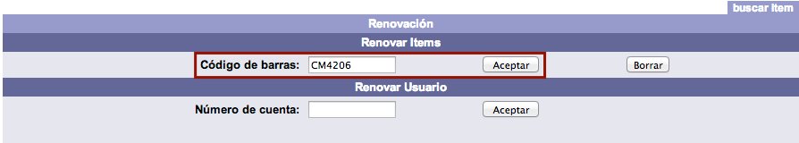
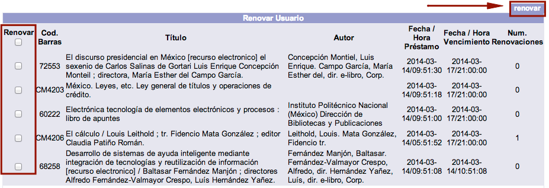

# Renovaciones

{{date}}

Consisten en la **ampliación del período de préstamo** de un material
por la misma cantidad de días u horas utilizadas en el momento del
préstamo original. Para que las renovaciones queden registradas en el
sistema deben cumplirse las siguientes condiciones:

-   En las políticas de
    circulación de la institución deben estar autorizadas las
    renovaciones de préstamos.

-   El préstamo no debe estar vencido.

-   El usuario no debe estar bloqueado por multa económica o sanción
    administrativa (*suspendido*).

-   El material no debe estar reservado previamente por otro usuario.

-   El usuario debe tener sus privilegios vigentes.

Existen tres formas de registrar una renovación:

-   En el módulo de Circulación, sección *Renovación*, opción **Renovar
    ítem**.

-   En el módulo de Circulación, sección *Renovación*, opción **Renovar
    usuario**.

-   En el catálogo al público, sección *Servicios al usuario*, opción
    **Información del usuario**. NOTA: esta forma es llevada a cabo
    directamente por el usuario usando sus datos de conexión (número de cuenta y contraseña).

### Procedimiento de renovación 1 (*Renovar ítem*)

Se utiliza cuando el usuario solicita la renovación de un **único
material**.

-   Hacer clic sobre la opción **Renovación** de la barra de
    herramientas del módulo.

-   Escribir el número de
    código de barras del material en el campo de texto de la
    sección destinada para ello y hacer clic en el botón **Aceptar**.

-   Al llevar a cabo la acción anterior, se despliegan en la parte
    inferior de la pantalla los datos del usuario y del material
    renovado, con la nueva fecha y hora de vencimiento, además del
    número de renovaciones efectuadas.

### Procedimiento de renovación 2 (*Renovar usuario*)

Se utiliza cuando el usuario solicita la renovación de **dos o más
materiales**. De esta manera, se pueden realizar todos los procesos en
una sola transacción.

-   Hacer clic sobre la opción **Renovación** de la barra de
    herramientas del módulo.

-   Escribir el número de
    cuenta del usuario en el campo de texto de la sección
    destinada para ello y hacer clic en el botón **Aceptar**.

-   Al llevar a cabo la acción anterior, se despliega la lista de los
    materiales que tiene prestados el usuario. Hacer clic en los cuadros de selección de
    aquellos ejemplares que se deseen renovar y, a continuación, en el
    botón **renovar** situado en la parte superior derecha de la
    pantalla.

-   Para terminar, el sistema genera el mensaje informando de la
    ejecución de las renovaciones. Hacer clic en el botón **Aceptar**.

### Alerta sobre el límite de renovaciones permitidas

En las políticas de circulación se define el número de renovaciones
permitidas cuando el material
no ha sido apartado por otro usuario y el préstamo se encuentra
vigente. Esta cifra determina las veces que un usuario puede
solicitar la renovación de un material que tiene prestado.

Cuando se ha registrado el **número máximo de renovaciones**, el sistema
avisa al operador del módulo sobre esta situación y no registra la
renovación solicitada.

En la opción *Renovar ítem*, el posible mensaje de alerta es el
siguiente:

> El usuario ha llegado al límite de renovaciones permitidas.  
> En la opción *Renovar usuario*, en cambio, al desplegar el sistema la
> lista de materiales prestados al usuario, en la parte izquierda de
> cada uno de ellos se muestra la indicación **Límite renovaciones**.
> Esto significa que no es posible registrar la renovación del material
> que tenga asociada dicha indicación.

Si se intenta registrar la renovación en cualquier caso, el posible
mensaje de alerta es el siguiente:

> No es posible renovar material alguno.

