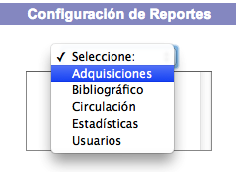
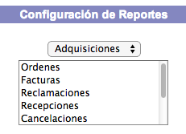
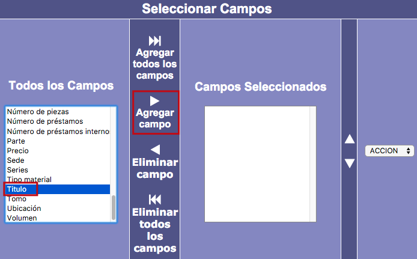
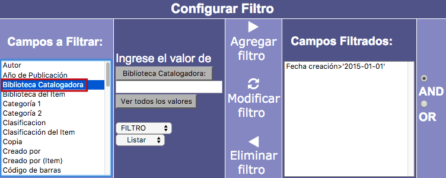
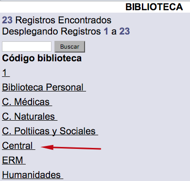
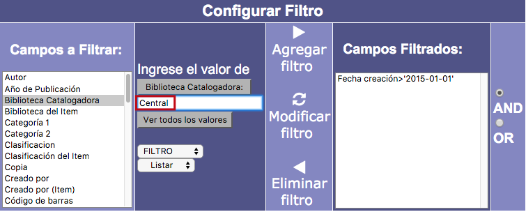
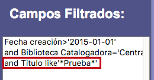
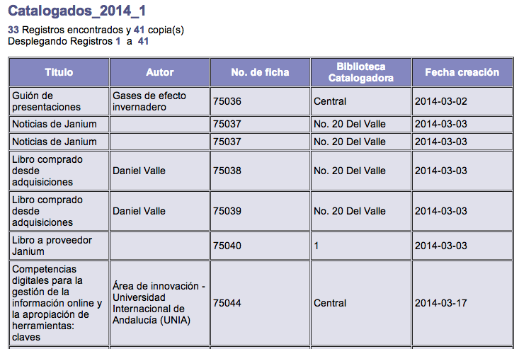
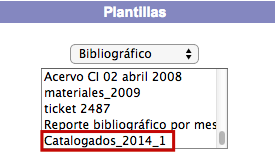

# Reportes e informes estadísticos

{{date}}

La misión principal de este módulo es permitir el **diseño de informes
que sirvan para organizar y presentar la información contenida en la
base de datos del sistema Janium**, aplicando un formato determinado a
los datos para mostrarlos de una manera visualmente atractiva y fácil de
interpretar por los usuarios. De esta forma, los reportes confieren una
mayor utilidad a los datos almacenados por la institución.

## Pantalla principal

En el caso particular de este módulo, tras el proceso de identificación
previo, la pantalla principal que se presenta es la siguiente:

## Barra de herramientas

Este elemento se presenta en primer plano al acceder a algún tipo de
reporte, sea a través de *Configuración de reportes* o de *Plantillas*.
El despliegue de las opciones que lo componen varía dependiendo de cual
se esté ejecutando en ese momento.

A continuación, se describen en detalle las opciones de la barra de
herramientas:

-   **Inicio:** permite acceder a la pantalla principal del módulo.

-   **Campos:** permite agregar o eliminar campos del reporte.

-   **Orden:** permite configurar los criterios de ordenación de los
    resultados del reporte por campos.

-   **Filtro:** permite establecer los filtros necesarios para depurar
    los datos obtenidos en el reporte.

-   **Plantilla:** permite guardar el diseño de reporte creado para ser
    usado en el futuro.

-   **Salida:** permite exportar los resultados del reporte.

## Configuración de reportes

### Elección del tipo de reporte

Haciendo clic en la lista desplegable de esta opción se muestran las
áreas sobre las que puede llevarse a cabo la consulta, para seleccionar
una de ellas.

Después de lo anterior, el sistema puede desplegar un listado de
categorías asociadas al reporte elegido, de nuevo para seleccionar una
de ellas, o bien, dar paso directamente a la siguiente pantalla del
proceso.

### Selección de campos

Con el tipo de reporte ya elegido, es necesario añadir los campos que se
desean visualizar en la consulta. Esto se hace seleccionando los campos
a incluir en la sección *Todos los campos* y, a continuación, haciendo
clic en el botón **Agregar campo** (o **Eliminar campo**, si se quiere
quitar alguno de ellos). También pueden usarse los botones **Agregar
todos los campos** y **Eliminar todos los campos**, si se quieren añadir
o quitar todos los campos de manera global.

Además, usando las flechas habilitadas para ello, se puede determinar la
**posición** o **lugar** en el que van a aparecer los campos dentro del
reporte.

En este momento también es posible establecer el tipo de tratamiento que
el sistema va a aplicar a los resultados, aunque esto puede hacerse más
adelante de igual forma. Para ello, hay que hacer clic en la lista
desplegable situada en la parte derecha. Existen dos variantes en este
sentido:

-   **Listar:** escogiendo esta opción, el sistema va a presentar todos
    los resultados detallados en una lista completa.

-   **Contar:** escogiendo esta opción, el sistema va a presentar los
    resultados como una cuenta de registros agrupada por cada uno de los
    resultados encontrados.

Para continuar con el proceso, hacer clic en la opción **Orden** de la
barra de herramientas del módulo.

### Asignación de criterios de orden

El siguiente paso es establecer las reglas de ordenación por campos que
van a seguirse. Esto se hace eligiendo los campos a ordenar en la
sección *Campos seleccionados* y, a continuación, haciendo clic en el
botón **Agregar orden** (o **Eliminar orden**, si se quiere quitar
alguno de ellos).

Con los campos ya elegidos, se debe decidir qué criterio de ordenación
de resultados va a aplicarse para cada uno de dichos campos:
*Ascendente* o *Descendente*. Este criterio puede ser cambiado usando el
botón **Modificar orden**.

Además, como en la sección anterior, aquí vuelven a presentarse las
flechas para determinar la **posición** o **lugar** en el que van a
aparecer los campos en el reporte, así como la lista desplegable para
establecer el **tipo de tratamiento** (listar o contar), que aquí
mantiene el valor ya señalado previamente.

Para continuar con el proceso, hacer clic en la opción **Filtro** de la
barra de herramientas del módulo.

### Aplicación de filtros

En esta fase van a definirse las condiciones específicas de restricción
que van a afectar a los resultados de la consulta. Esto se hace, en
primer lugar, eligiendo los **campos a filtrar** en la sección
correspondiente de la parte izquierda de la pantalla.

Después, se debe introducir en el campo de texto el **valor concreto**,
relacionado con el campo seleccionado, que va a formar parte del filtro.
En este sentido, puede consultarse la totalidad de los datos recogidos
en la base de datos para el campo elegido haciendo clic en el botón *Ver
todos los valores*.

A continuación, seleccionar el **tipo de filtro** deseado de la lista
desplegable habilitada para ello.

Los tipos de filtros que se pueden aplicar son los siguientes:

-   **= :** igual a.

-   **&lt; &gt; :** distinto a.

-   **&gt; :** mayor que.

-   **&lt; :** menor que.

-   **&gt; = :** mayor o igual a.

-   **&lt; = :** menor o igual a.

-   **Al inicio:** el valor o valores introducidos deben aparecer justo
    al comienzo de la información dentro del campo.

-   **Al final:** el valor o valores introducidos deben aparecer justo
    al final de la información dentro del campo.

-   **Contiene:** la información del campo debe contener el valor o
    valores introducidos, sea cual sea su posición dentro de la misma.

-   **Nulo:** en el campo elegido para el filtro no debe existir ningún
    tipo de dato, tiene que estar vacío.

-   **No nulo:** en el campo elegido para el filtro debe existir algún
    tipo de dato, no puede estar vacío.

Finalmente, hacer clic en el botón **Agregar filtro** (o **Eliminar
filtro**, si se quiere quitar alguno de los incluidos ya. O **Modificar
filtro**, si se quiere cambiar alguno de los parámetros del mismo).

Además, pueden usarse los operadores *booleanos* AND y OR para
establecer cómo van a combinarse los filtros creados.

Para continuar con el proceso, hacer clic en la opción **Plantilla** de
la barra de herramientas del módulo.

#### Ejemplos de aplicación de varios filtros y operadores *booleanos* combinados

##### *Materiales catalogados por la biblioteca Central durante 2015*

El primer filtro se mantiene con los parámetros ya explicados. Es decir,
el campo *Fecha creación*, el valor introducido en el cuadro de texto
*2015\_01–01* y el valor elegido en la lista desplegable **&gt;** (mayor
que).

Para establecer el segundo filtro:

-   En la sección *Campos a filtrar*, elegir el campo **Biblioteca
    catalogadora**.

-   Hacer clic en el botón *Ver todos los valores* y en la ventana
    emergente que se despliega, buscar el valor **Central** y
    seleccionarlo haciendo clic sobre su nombre. El sistema lo introduce
    automáticamente en el cuadro de texto correspondiente.

-   En la lista desplegable de tipos de filtros, elegir el valor **=**
    (igual a).

-   Hacer clic en el botón *Agregar filtro* para agregar el filtro a la
    sección *Campos filtrados*.

Sobre los operadores *booleanos*: el sistema Janium aplica por omisión
el operador **AND**. Por lo tanto, en este ejemplo, las condiciones
serían interpretadas como: “buscar aquellos materiales catalogados a
partir del día 1 de enero de 2015 **Y** los catalogados por la
biblioteca Central”.

Para cambiar el operador y, por extensión, el tipo de interactuación
entre los filtros, se debería hacer clic sobre el segundo filtro
definido (en la sección *Campos filtrados*), a continuación, seleccionar
la opción **OR** y, finalmente, hacer clic sobre el botón *Modificar
filtro*. Con este cambio, las condiciones serían interpretadas como:
“buscar aquellos materiales catalogados a partir del día 1 de enero de
2015 **O** los catalogados por la biblioteca Central”.

##### *Materiales catalogados “de prueba” por la biblioteca Central durante 2015*

El primer filtro se mantiene con los parámetros ya explicados. Es decir,
el campo *Fecha creación*, el valor introducido en el cuadro de texto
*2015\_01–01* y el valor elegido en la lista desplegable **&gt;** (mayor
que).

El segundo filtro se mantiene con los parámetros ya explicados. Es
decir, el campo *Biblioteca catalogadora*, el valor introducido en el
cuadro de texto *Central* y el valor elegido en la lista desplegable
**=** (mayor que).

Para establecer el tercer filtro:

-   En la sección *Campos a filtrar*, elegir el campo **Titulo**.

-   Introducir el término ***Prueba*** en el cuadro de texto
    correspondiente.

-   En la lista desplegable de tipos de filtros, elegir el valor
    **Contiene**.

-   Hacer clic en el botón *Agregar filtro* para agregar el filtro a la
    sección *Campos filtrados*.

Las consideraciones sobre **operadores *booleanos*** que se mencionan
para el primer ejemplo son válidas también para este.

### Creación y actualización de plantillas

Esta sección permite **guardar los reportes diseñados para su uso
posterior**, sin necesidad de tener que crearlos de nuevo desde el
principio cada vez que se quieran ejecutar. Esto se hace rellenando con
la información necesaria los tres campos de texto que aparecen: nombre,
título y descripción. En esta sección también pueden modificarse los
datos de identificación ya guardados sobre los reportes.

Entrando en detalle, las opciones que se presentan son las siguientes:

-   **Guardar:** al hacer clic en el botón, se guarda el reporte creado,
    se genera un mensaje para informar del éxito del proceso y el
    sistema regresa a la pantalla de creación y actualización de
    plantillas.

-   **Guardar y Salir:** al hacer clic en el botón, se guarda el reporte
    creado, se genera un mensaje para informar del éxito del proceso y
    el sistema muestra la pantalla de inicio del módulo.

-   **Guardar y Ejecutar reporte:** al hacer clic en el botón, se guarda
    el reporte creado, se genera un mensaje para informar del éxito del
    proceso y el sistema despliega los resultados de la ejecución del
    reporte.

-   **Borrar:** al hacer clic en el botón, se genera un mensaje de aviso
    para permitir el borrado definitivo del reporte.

-   **Cancelar:** al hacer clic en el botón, el sistema regresa a la
    sección *Campos*.

#### Ejemplo de visualización de reporte ejecutado

Este es un ejemplo de cómo se presenta en pantalla la información del
reporte al ser ejecutado por el sistema Janium.

### Configuración de métodos de salida

En esta última fase puede elegirse el **método y tipo de formato de
salida** para el reporte seleccionado.

Las opciones disponibles son las siguientes:

-   **Generar salida para impresión:** crea un fichero de texto plano
    con la información del reporte destinado a ser impreso. Puede
    definirse la longitud de las líneas de texto del fichero mediante el
    parámetro *Recortar a …… caracteres*, indicando la cifra deseada en
    el cuadro de texto.

-   **Exportar reporte:** genera un fichero externo con la información
    del reporte para que sea guardado en el equipo local. Puede
    definirse que dicho fichero se exporte en los siguientes formatos:
    *texto plano* (con o sin encabezado), *CSV* (con o sin encabezado) y
    *PDF*.

    Sobre la exportación en PDF:

    -   Los resultados de los reportes en este formato aparecen
        estructurados en forma de tabla.

    -   El encabezado de estos reportes corresponde al título indicado
        por el usuario durante la creación de los mismos.

    -   Las páginas de los ficheros aparecen fechadas y numeradas.

    -   Es posible utilizar una plantilla prefijada, de manera que el
        reporte muestre encabezados corporativos, logos, etc.

-   **Enviar reporte por correo:** se envía un correo electrónico a la
    dirección indicada con la información del reporte.

Para llevar a cabo cualquiera de las acciones explicadas, se debe hacer
clic en el botón **Ejecutar**, o clic en el botón **Regresar** para
volver a la sección *Campos*.

## Selección y uso de plantillas

Como se ha visto anteriormente, una vez diseñados, los reportes pueden
ser almacenados mediante el uso de plantillas, para que puedan ser
ejecutados en el futuro sin tener que crearlos desde el principio cada
vez.

Para realizar esta acción, sólo es necesario seleccionar el área dentro
de la lista desplegable que nos muestra el sistema y, a continuación,
elegir la plantilla correspondiente haciendo clic sobre su nombre.

Este paso permite cargar el reporte seleccionado para poder trabajar con
él, bien sea ejecutándolo o modificando sus parámetros para llevar a
cabo una nueva consulta a partir del mismo.

### Reportes preconfigurados

Este tipo de reportes no pueden ser modificados por los operadores del
módulo, sólo ejecutados, ya que **son diseñados desde el departamento de
Soporte técnico**, para responder a las peticiones y solicitudes de las
instituciones.

Son reportes que afectan a dos o más módulos del sistema Janium al mismo
tiempo, por lo que no pueden ser creados desde el módulo de Reportes. De
forma resumida, lo que hacen es ejecutar una orden de lenguaje SQL
(*query*) de manera directa contra la base de datos y mostrar los
resultados.

