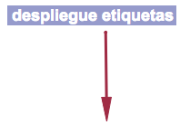
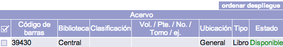
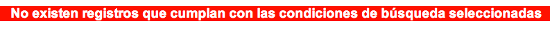

# Resultados de búsqueda en Control bibliográfico

{{date}}

## Sumarios de resultados

Si se recupera más de un registro que coincida con los términos
introducidos, se despliega un sumario de resultados como el siguiente:

NOTA: esta opción de
despliegue de resultados sólo se da en búsquedas **por palabra clave**.

(Ejemplo de búsqueda: término *Medicina*, opción *Por palabra clave*,
índice *Título*)

Los elementos de que consta este modo de despliegue son:

-   **Información sobre registros encontrados en total y desplegados por
    página.**

-   **Botón de limitación de resultados:** da paso a la pantalla que
    permite modificar los datos obtenidos para hacerlos más precisos.

-   **Flecha de cambio de página de resultados.**

-   **Casillas de selección:** permiten seleccionar los registros
    deseados para usarlos posteriormente; por ejemplo, para crear una
    bibliografía o asignarles una *tag*.

-   **Columna Título:** muestra, de forma predeterminada, el año de
    publicación, el número de clasificación y el título del material.

-   **Columna Autor:** muestra, de forma predeterminada, la información
    relacionada con el autor o autores y demás menciones de
    responsabilidad.

-   **Columna Info:** muestra, de forma predeterminada, la biblioteca
    catalogadora, el formato del registro, el tipo de material, el
    estado del material y el número de ejemplares.

Además del modo de despliegue de sumario de resultados que se acaba de
explicar, hay otras variantes que tienen lugar en diferentes
situaciones:

### Sumario a partir de búsqueda por índice Tema

### Sumario a partir de búsqueda por índice ISBN

### Sumario a partir de búsqueda por índice Clasificación

## Registro único

En ocasiones, es posible que sólo se recupere un único registro que se
ajuste a los criterios requeridos en la búsqueda. En esos casos, esto es
lo que se muestra:

NOTA: esta opción de
despliegue de resultados sólo se da en búsquedas **por palabra clave** o
**por número de ficha y código de barras**.

(Ejemplo de búsqueda: términos *Diccionario de mitología universal*,
índice *Título* )

Las dos secciones de que consta este modo de despliegue son:

**Información
bibliográfica**

Con los siguientes elementos destacados:

-   **Botón para compartir registro:** permite generar un *permalink* al
    registro seleccionado para su publicación en redes sociales o envío
    por correo electrónico.

-   **Botón *Nuevo item***: permite crear un nuevo ejemplar asociado
    al registro bibliográfico.

-   **Botón *Duplicar*:** ejecuta una duplicación del registro que está
    desplegado en ese momento.

-   **Botón para desplegar etiquetas:** da acceso a la vista en formato
    MARC21 de la información.

-   **Campos descriptivos:** contienen los datos relativos al registro.
    El contenido de algunos de ellos enlaza con las autoridades
    asociadas.

**Información de
ejemplares**

En aquellos casos en que el registro bibliográfico tiene asociado algún
ejemplar o existencia, es en este apartado donde puede visualizarse la
información descriptiva de cada uno de estos **ítems**, como es su
localización física, colección a la que pertenece, tipo de material o
estado en el que se encuentra.

También es posible modificar la forma en que se ordenan los campos
mostrados en esta sección. Para ello, se debe hacer clic en el botón
*Ordenar despliegue*, lo que da paso a una ventana emergente donde
personalizar la configuración.

## Búsqueda sin resultados

Cuando al ejecutar una búsqueda no se recupera ningún resultado
coincidente, el sistema genera un **sumario de posibles registros**
relacionados con los términos introducidos, a partir de una búsqueda
alfabética por la primera palabra escrita.

Si se produce la circunstancia de que no exista equivalencia alguna
entre los términos de búsqueda introducidos y la información recogida en
el sistema, lo que se despliega es un mensaje avisando de la situación.

## Recursos vinculados

El listado de archivos vinculados a un registro se muestra con el
siguiente estilo por defecto, en la vista en *Detalle*:

