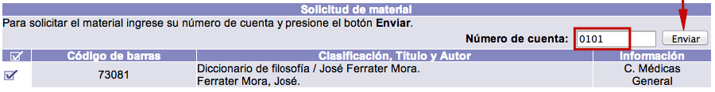
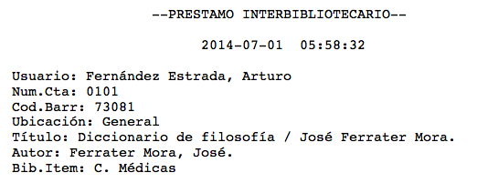
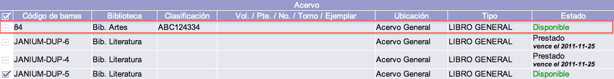

# Solicitud de materiales para préstamo desde el Catálogo

Cuando la institución cuenta con un sistema de estantería cerrada (esto es, no se permite el acceso de los usuarios a las colecciones), puede ser recomendable activar esta opción.

Esta *solicitud de préstamo* no es un mensaje dirigido a una cuenta de correo electrónico o que simplemente se visualice en pantalla, sino que su objetivo es ser **enviada e impresa**, por ejemplo, en el mostrador de préstamo de la institución.

El proceso se lleva a cabo desde la información de los ejemplares, asociada al despliegue en detalle del registro. Para ello, se debe marcar la **casilla de selección** situada a la izquierda de cada una de las existencias, para a continuación hacer clic en el **botón** _**Solicitar préstamo**_.

Una vez en la pantalla de solicitud de material, es necesario introducir el **número de cuenta** correspondiente al usuario que requiera el préstamo del ejemplar seleccionado y hacer clic en el botón ***Enviar***.

Finalmente, se genera la papeleta de préstamo para el usuario, que debe ser enviada para su impresión a la impresora predeterminada, con el objetivo de que llegue al mostrador de circulación.

Es importante mencionar que todo material que es solicitado por un usuario, aparece como **no seleccionable** en el despliegue de ejemplares, aunque se muestre aún con el estado *Disponible*. De esta forma se evita que dos o más usuarios soliciten el mismo material. Cabe aclarar que esta circunstancia no se produce hasta que el usuario envía la solicitud, no en el momento de marcar el ítem.

En la siguiente imagen de ejemplo, donde se destaca el material con el código de barras 84, aunque aparece Disponible no puede ser seleccionado por el usuario ya que ha sido solicitado en préstamo por alguien más.

