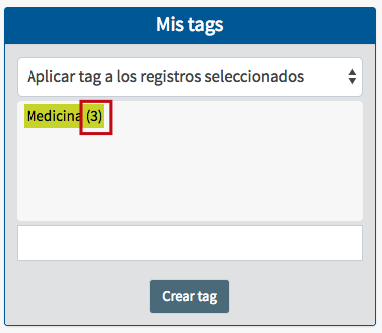

# Tags

Accediendo al catálogo al público con un número de cuenta y contraseña de usuario registrado también se pueden gestionar **tags** (o etiquetas). Esencialmente, esta función permite etiquetar grupos de registros bibliográficos usando términos que los identifiquen, con la idea de compartir estas categorías con otros usuarios del catálogo.

Su objetivo es, por tanto, describir y contextualizar la información, permitiendo a un usuario o grupo de usuarios ordenar, clasificar y compartir información (registros, contenidos, recursos, etc.) mediante una o más _palabras clave_.

En el sistema Janium, es posible crear dos tipos de tags:

- _Tags privadas_: aquellas que el usuario aplica a los registros para su uso personal. Ningún otro usuario puede verlas a través del catálogo.

- _Tags públicas_: aquellas que pueden ser vistas por todos los usuarios del catálogo, pero **sólo pueden ser creadas por aquellos a quienes se ha asignado el permiso correspondiente**.

Para llevar a cabo este procedimiento, se debe considerar lo siguiente:

1.  El usuario puede crear tags privadas y públicas con el mismo nombre.
2.  No es posible crear dos tags del mismo tipo con el mismo nombre.
3.  No es posible crear una tag pública con un nombre que ya haya sido utilizado por otro usuario.

### Ventajas

- Agrupación de registros bibliográficos en categorías temáticas concretas.
- Asignación de múltiples tags a un mismo registro bibliográfico.
- Recuperación de registros bibliográficos a través de sus tags.
- Libertad de creación de tags por parte de los usuarios del catálogo.

### Creación de tags

El procedimiento a seguir es el siguiente:

- Acceder a la función a través de la barra de herramientas del catálogo al público. Se presenta la pantalla conjunta de gestión de bibliografías y tags, con esta última sección situada en la parte derecha.

- Escribir el nombre elegido para la tag en el campo de texto destinado para ello y hacer clic en el botón **Crear tag**.

    _NOTA_: los nombres utilizados para la creación de tags **no deben tener espacios en blanco**. En su lugar, si estos nombres se componen de dos o más palabras, se recomienda separarlas mediante guiones o guiones bajos.

- Se muestra el mensaje de confirmación de la acción y la tag aparece incluida en la sección correspondiente.

### Agregar tags a registros

El procedimiento a seguir es el siguiente:

- Elegir los registros bibliográficos que se desean relacionar con una tag. Esto puede llevarse a cabo desde el _sumario de resultados_ o desde la _vista en detalle_ del registro. En ambos casos, se deben seleccionar marcando el cuadro situado en la parte izquierda de los mismos.A continuación, acceder a la función *Tags* a través de la barra de herramientas del módulo.

- Escoger la opción ***Aplicar tag a los registros seleccionados*** en la lista desplegable de la sección. Después, hacer clic sobre el nombre de la tag que se desea aplicar a los registros.

- Se muestra el mensaje de confirmación de la acción y se actualiza el contador numérico de la tag.

### Despliegue de registros con tags

Los usuarios pueden consultar qué registros tienen tags de dos formas:

- A través del Referencista electrónico.
- A través de los Servicios de alerta. En este caso, las tags se despliegan en la sección ***Tagcloud***.

Al hacer clic sobre una de ellas se despliega la lista de registros relacionados. Y al acceder a la vista en detalle de cada uno de ellos, se presentan en la parte inferior las **tags públicas** aplicadas al mismo.

### Quitar tags a registros

El usuario que ha aplicado una tag a una serie de registros tiene el mismo privilegio para poder quitarla, no pudiendo hacer esto con respecto a tags de otros usuarios.

El procedimiento a seguir es el siguiente:

- Una vez escogidos los registros en cuestión, elegir la opción ***Quitar tag de los registros seleccionados*** en la lista desplegable de la sección. Después, hacer clic sobre el nombre de la tag que se desea desvincular de los registros.

- Se muestra el mensaje de confirmación de la acción y se actualiza el contador numérico de la tag.

### Borrado de tags

El procedimiento a seguir es el siguiente:

- Elegir la opción ***Eliminar tag*** en la lista desplegable de la sección. Después, hacer clic sobre el nombre de la tag que se desea borrar.

    _NOTA_: este proceso sólo puede realizarse sobre tags que **no tienen ningún registro asociado**, por lo que es necesario llevar a cabo antes el paso previo a este (*Quitar tags a registros*).

- Se muestra el mensaje de confirmación de la acción.

