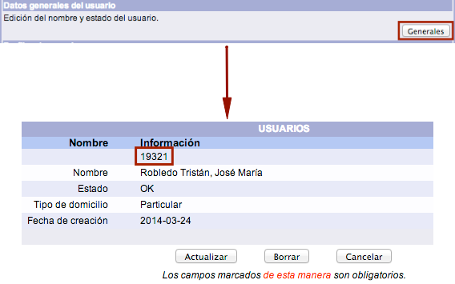
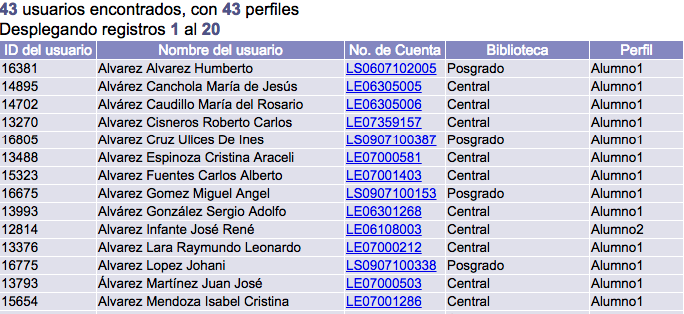

meta-json: {"viewport":"width=device-width, initial-scale=1.0, maximum-scale=1.0,\nuser-scalable=0","robots":"noindex,follow","title":"Usuarios | Ayuda contextual de Janium","generator":["Divi v.2.2","WordPress 4.0.18"]}
robots: noindex,follow
title: Usuarios | Ayuda contextual de Janium
viewport: width=device-width, initial-scale=1.0, maximum-scale=1.0, user-scalable=0
Date:Nov 26, 2014

# Usuarios

[%Date]

Esta sección del módulo está relacionada con la **administración de
usuarios** y en ella se ejecutan las funciones de búsqueda, creación,
modificación y borrado de los mismos.

Además, de forma adicional, también es posible vincular una fotografía
al usuario, o crear notas internas informativas para su uso por parte de
los operadores del módulo.

Independiente de esta sección es **Despliegue del usuario**, cuyo uso
principal es mostrar la información de circulación global
vinculada al usuario seleccionado.

## Búsqueda de usuarios

Desde la pantalla de **administración de usuarios** es posible buscar
registros de usuarios por: ID del usuario, número de cuenta,
identificador alterno y nombre. Estas búsquedas tienen como objetivo
tener como **registro activo** al usuario requerido, para después poder
desplegar, modificar o borrar su información.

### Búsqueda por ID del usuario

El ID del usuario es el número asignado de forma automática **por el
sistema** a cada usuario. Este número es único e irrepetible, por lo que
no puede ser utilizado para otro usuario y no puede ser modificado por
los operadores del módulo.

El ID del usuario no aparece en la ficha de introducción de datos. Para
verlo, es necesario acceder a la sección *Datos generales del usuario*,
mediante el botón **Generales**.

El procedimiento a seguir es el siguiente:

-   Hacer clic sobre la opción **Usuarios** de la barra de herramientas
    del módulo.

-   Escribir el ID del
    usuario en el campo de texto correspondiente de la sección
    *Selección de usuario*. Hacer clic en el botón **Buscar**.

-   El sistema muestra el nombre del usuario como **registro activo**.

### Búsqueda por número de cuenta e identificador alterno

El **número de cuenta** es el dato principal por el cual es identificado
el usuario para poder registrarle operaciones en el módulo de
Circulación (préstamos, devoluciones, etc.). Además, es el que usa el
propio usuario para ingresar a *Servicios al usuario*. Puede ser
alfanumérico y tener una longitud de hasta 320 caracteres. Por otro
lado, debe ser **único**; es decir, dos personas diferentes no pueden
tener el mismo número de cuenta. Cabe mencionar que es sensible a
mayúsculas y minúsculas (el número de cuenta PRUEBA es diferente al número
de cuenta prueba).

En cuanto al **identificador alterno**, como su nombre indica, es otro
elemento complementario que puede ser usado para identificar a un
usuario. También puede ser alfanumérico, tener una longitud de 320
caracteres y deber ser **único**. Su uso es opcional, por lo que es
responsabilidad de la institución decidir si su introducción es
obligatoria o no.

El procedimiento a seguir es el siguiente: (Tomamos como ejemplo una
búsqueda por número de
cuenta)

-   Hacer clic sobre la opción **Usuarios** de la barra de herramientas
    del módulo.

-   Seleccionar la opción de búsqueda deseada y escribir el dato en el
    campo de texto correspondiente de la sección *Selección de usuario*.
    Hacer clic en el botón **Buscar**.

-   El sistema muestra el nombre del usuario como **registro activo**.

### Búsqueda por nombre

En este sentido, en primer lugar, la institución debe elegir la **forma
de escritura** que va a ser utilizada para registrar los nombres de sus
usuarios, ya que el método de búsqueda que lleva a cabo el sistema es
alfabético.

Por ejemplo, si se decide registrar los nombres con el orden
**Apellido(s), Nombre(s)** no será posible hacer búsquedas comenzando con el nombre del
usuario (como María, Juan, José) al no ser éste el primer dato del
campo. Ahora bien, no es necesario introducir el nombre completo del
usuario para ejecutar la búsqueda, bastando con una parte del término.

El procedimiento a seguir es el siguiente:

-   Hacer clic sobre la opción **Usuarios** de la barra de herramientas
    del módulo.

-   Escribir el nombre del
    usuario en el campo de texto correspondiente de la sección
    *Selección de usuario*. Hacer clic en el botón **Buscar**.

-   Se despliega una ventana emergente con la lista de usuarios
    coincidentes con los términos introducidos. Hacer clic sobre el
    **número de cuenta** deseado.

-   El sistema transfiere la información a la pantalla anterior y
    muestra el nombre del usuario como **registro activo**.

#### Uso de *comodines* en búsqueda por nombre

En esta opción de búsqueda de usuarios, es posible usar el símbolo de
truncamiento * (asterisco) como *comodín* cuando se tengan
dudas sobre el término que se desea encontrar, o bien cuando se quiera
llevar a cabo una búsqueda amplia de usuarios.

Los comodines pueden utilizarse de dos formas:

-   Colocados al **comienzo** de la raíz del término.

-   Colocados **al final** de la raíz del término.

## Consulta y edición de datos generales del usuario

Es posible realizar consultas y cambios en algunas de las informaciones
ya recogidas en el registro del usuario.

El procedimiento a seguir es el siguiente:

-   Hacer clic sobre la opción **Usuarios** de la barra de herramientas
    del módulo.

-   Buscar al usuario en cuestión por ID del usuario, número de cuenta /
    identificador alterno o nombre.
-   Teniendo al usuario como **registro activo**, hacer clic en el botón
    **Generales** de la sección *Datos generales del usuario*.

-   El sistema muestra la pantalla de *USUARIOS*. Hacer clic sobre el
    botón **Actualizar**, en caso de que se necesiten modificar los
    datos de alguno de los campos permitidos (nombre, estado y tipo de
    domicilio). Para guardar los cambios, dar clic de nuevo en el botón
    **Actualizar**.

