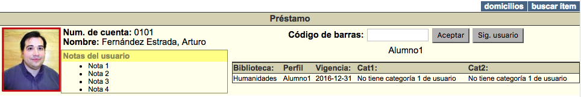
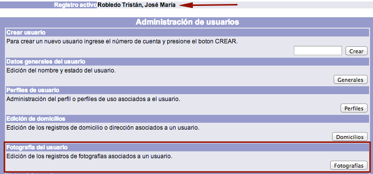
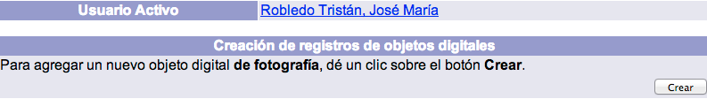
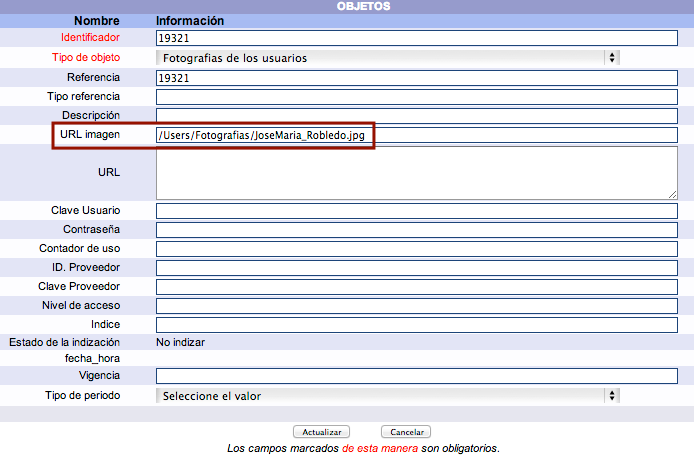
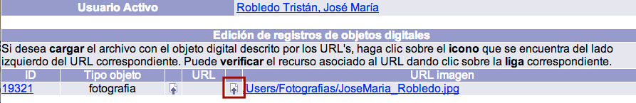
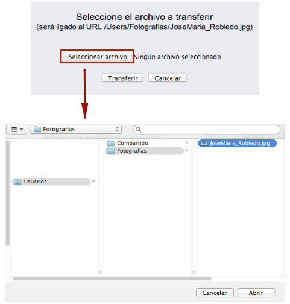
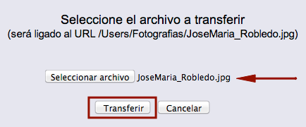
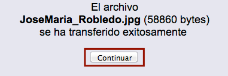

meta-json: {"viewport":"width=device-width, initial-scale=1.0, maximum-scale=1.0,\nuser-scalable=0","robots":"noindex,follow","title":"Vinculación de fotografía al usuario | Ayuda contextual de Janium","generator":["Divi v.2.2","WordPress 4.0.18"]}
robots: noindex,follow
title: Vinculación de fotografía al usuario | Ayuda contextual de Janium
viewport: width=device-width, initial-scale=1.0, maximum-scale=1.0, user-scalable=0
Date:Nov 26, 2014

# Vinculación de fotografía al usuario

[%Date]

La fotografía que es asociada al registro de un usuario se ve en las
funciones de **préstamo**, **devolución** y **despliegue del usuario**,
para permitir una identificación adecuada del mismo.

El procedimiento a seguir es el siguiente:

-   Hacer clic sobre la opción **Usuarios** de la barra de herramientas
    del módulo.

-   Buscar al usuario en cuestión por ID del usuario, número de cuenta / identificador
    alterno o nombre.
-   Teniendo al usuario como **registro activo**, hacer clic en el botón
    **Fotografías** de la sección *Fotografía del usuario*.

-   Se despliega la pantalla de asignación de objetos digitales para el
    usuario activo. Hacer clic sobre el botón **Crear**.

-   En el formulario que aparece, presionar el botón **Actualizar** para
    poder editar la información del mismo. Dentro del campo *URL
    imagen*, escribir la ruta y el nombre del archivo de fotografía.
    Hacer clic de nuevo en el botón **Actualizar** para guardar los
    cambios.

-   El sistema muestra la pantalla de edición de registros de objetos
    digitales. Dar clic en el icono **Subir objetos** ubicado a la
    izquierda del campo *URL imagen*.

-   En la ventana emergente que aparece, hacer clic en el botón
    **Examinar** (o **Seleccionar archivo**, dependiendo del explorador
    del usuario) para proceder a seleccionar el archivo a transferir en
    el equipo local.

-   Una vez hecho lo anterior, la ruta y el nombre del archivo se
    muestran en el campo de texto de la ventana emergente ya mencionada.
    Hacer clic en el botón **Transferir**.

-   Finalmente, el sistema despliega el mensaje de transferencia
    exitosa. Hacer clic sobre el botón **Continuar** para concluir el
    proceso.

