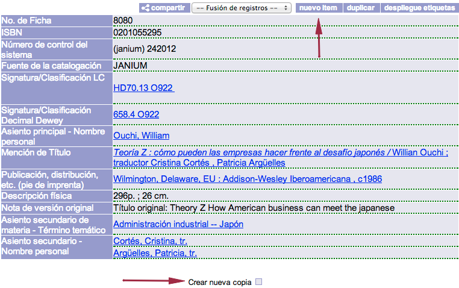
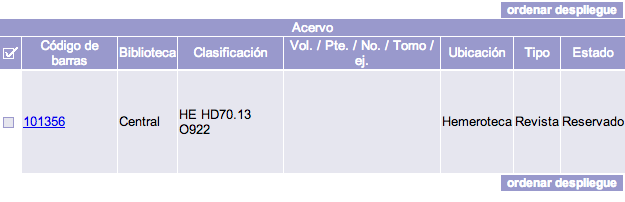
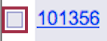
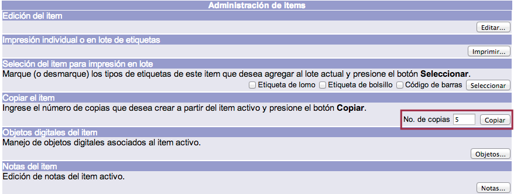
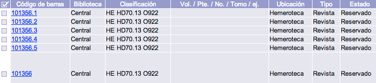
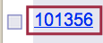
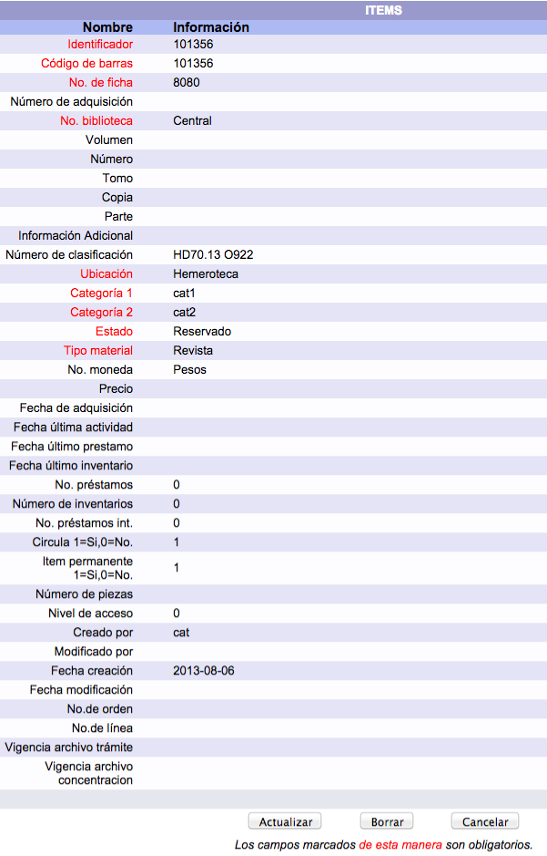

# Administración de ítems
## Creación y edición de registros de ejemplar

Este procedimiento consiste en la creación de un registro de ejemplar para el **registro bibliográfico activo** (VER NOTA ACLARATORIA) en la sesión. De esta manera, se deja constancia de las existencias de un material, junto con las características necesarias para su
identificación y localización.

Por lo general, un nuevo ejemplar se crea cuando:

-   Es un ejemplar de un nuevo registro bibliográfico.
-   Es un ejemplar adicional de un registro bibliográfico ya existente.
-   Es un ejemplar de un registro bibliográfico creado por duplicación.
-   Es un ejemplar de un registro bibliográfico creado por copiado.

Así, teniendo en cuenta lo ya indicado, con un registro desplegado, se debe elegir una de las opciones siguientes:

+ **Nuevo ítem**, que se localiza en la parte superior derecha del despliegue bibliográfico del registro.
+ **Crear nueva copia**, colocada debajo de la información detallada del registro.

Una vez seleccionada cualquiera de las opciones mencionadas, se muestra la información correspondiente al ejemplar creado en la zona inferior de la ficha, incluido su número de código de barras. Es importante destacar que los registros de ejemplares **son creados con valores predefinidos en las *Preferencias*, y que estos pueden ser cambiados a partir de la edición de los ejemplares**.

#### Nota aclaratoria sobre registros activos

Un registro activo es el último registro:

-   Creado en la sesión,
-   Desplegado en vista de detalle, o bien
-   Editado a través de la plantilla.

Mientras un registro se mantenga activo, **no podrá ser editado** por otro operador del módulo, desplegándose un mensaje de alerta del sistema si se intenta dicha acción.

Para que un registro **deje de estar activo** es necesario:

-   Crear un nuevo registro.
-   Desplegar otro registro.
-   Editar otro registro.
-   Terminar la sesión.

### Creación masiva de ejemplares

Consiste en crear dos o más ejemplares para un mismo registro bibliográfico de forma unificada. De esta forma, con una sola acción, es posible dar de alta un gran número de ellos. Para llevar a cabo esta acción es necesario haber creado un primer ejemplar para dicho registro bibliográfico. Los ejemplares posteriores **tendrán las mismas características del ejemplar inicial** y el código de barras será **el mismo más un número diferenciado**. Esto es importante para aquellas bibliotecas que tengan configurada la generación de códigos de barras, pues la secuencia se vería afectada.

Para comenzar el proceso, se debe hacer clic sobre el cuadro selector ubicado a la izquierda del código de barras.

En la pantalla de **administración de ítems**, dentro de la sección *Copiar el ítem*, se debe escribir la cantidad de ejemplares que se desean crear masivamente y hacer clic en el botón *Copiar*.

Finalmente, se muestra de nuevo el registro bibliográfico con los datos agregados sobre los nuevos ejemplares.

### Edición de registros de ejemplar

Para editar un ejemplar es necesario tener el registro bibliográfico desplegado con la línea correspondiente a dicho ejemplar en la parte inferior de la pantalla.

Hecho esto, para acceder al menú de modificación de ítems, se debe hacer clic sobre el código de barras del ejemplar.

Para llevar a cabo los cambios deseados es necesario presionar el botón *Actualizar*. Y, una vez realizados, se debe hacer clic en el mismo botón para confirmarlos, o bien en el botón *Cancelar* para regresar a la pantalla anterior.

**NOTA:** es posible configurar el sistema para permitir la **entrada inmediata al modo de edición** de un ítem desde la página de *Detalle*.

De esta forma, al hacer clic sobre el vínculo asociado al código de barras del ítem a editar, se entrará primero a la interfaz en modo de sólo lectura, como sucede por defecto, pero de inmediato el sistema dará paso a la pantalla de edición.

#### Campos detallados del formulario de registros de ejemplar

*Identificador*. Número asignado automáticamente por el sistema al registro del ejemplar. Campo obligatorio.

*Código de barras*. Número de código de barras asignado por el sistema acorde a la configuración de la “máscara” de códigos de barras. Campo obligatorio.

*No. de ficha*. Número de ficha del registro bibliográfico al cual está vinculado el registro del ejemplar. Campo obligatorio.

*Número de adquisición*. Número de adquisición asignado por el sistema acorde a la configuración de la máscara de códigos de barras o por la biblioteca.

*Biblioteca*. Biblioteca propietaria del ejemplar. Es seleccionada a partir de la lista de opciones que se configura en el sistema. Campo obligatorio.

*Volumen*. Número de volumen que tiene el ejemplar. Este número será impreso como número de volumen en las etiquetas. Si no tiene volumen asignado, el campo queda vacío.

*Número*. Número que tiene el ejemplar. Este número será impreso como número en las etiquetas. Si no tiene número asignado, el campo queda vacío.

*Tomo*. Número de tomo que tiene el ejemplar. Este número será impreso como tomo en las etiquetas. Si no tiene tomo asignado, el campo queda vacío.

*Copia*. Número de ejemplar que le corresponde. Este número será impreso como copia o ejemplar en las etiquetas.

*Parte*. Número de parte que le corresponde al ejemplar. Este número será impreso como parte en las etiquetas. Si no tiene número de parte asignado el campo queda vacío.

*Información Adicional*. Otra información relacionada con el ejemplar. Esta información puede llegar a imprimirse como parte de las etiquetas.

*Ubicación*. Ubicación asignada al ejemplar. Es seleccionada a partir de la lista de opciones que se configura en el sistema. Campo obligatorio.

*Categoría 1*. Categoría 1 del ejemplar vinculada al registro. Es seleccionada a partir de la lista de opciones que se configura en el sistema. Campo obligatorio.

*Categoría 2*. Categoría 2 del ejemplar vinculada al registro. Es seleccionada a partir de la lista de opciones que se configura en el sistema. Campo obligatorio.

*Estado*. Estado del material vinculado al registro. Es seleccionado a partir de la lista de opciones que se configura en el sistema. Campo obligatorio.

*Tipo material*. Tipo de material asignado al registro. Es seleccionado a partir de la lista de opciones que se configura en el sistema. Campo obligatorio.

*No. moneda*. Tipo de moneda utilizada para la adquisición de este ejemplar. Es seleccionado a partir de la lista de opciones que se configura en el sistema.

*Precio*. Precio de adquisición del material. Se complementa con el campo No. moneda.

*Fecha de adquisición*. Fecha de adquisición del material en formato AAAMMDD.

*Fecha última actividad*. Fecha de la última actividad registrada en el módulo de circulación sobre el material, en formato AAAAMMDD.

*Fecha último préstamo*. Fecha del último préstamo registrado del material en formato AAAAMMDD.

*Fecha último inventario*. Fecha del último inventario registrado del material en formato AAAAMMDD.

*Número de préstamos*. Número total de préstamos registrados del material.

*Número de inventarios*. Número total de veces que ha sido inventariado.

*Número de préstamos internos*. Número total de préstamos en sala registrados del material.

*Circula*. Determina si el ejemplar se presta o no. El valor 1 significa que se presta, el valor 0 significa que no se presta.

*Item permanente*. Determina si el ejemplar es permanente o temporal en el sistema. El valor 1 significa que es permanente, el valor 0 significa que es temporal.

*Número de piezas*. Número de piezas o unidades de que se compone el ejemplar. Si el campo está vacío significa que tiene 1 pieza.

*Nivel de acceso*. Número de nivel de acceso mínimo que el usuario debe tener para poder desplegar el ejemplar y obtener el préstamo.

*Creado por*. Número de cuenta del operador del módulo responsable de la creación del registro del ejemplar.

*Modificado por*. Último número de cuenta del operador del módulo que realizó alguna modificación al registro del ejemplar.

*Fecha creación*. Fecha de creación del registro del ejemplar en formato AAAAMMDD.

*Fecha modificación*. Última fecha de modificación del registro del ejemplar en formato AAAAMMDD.

*No. de orden*. Número de orden de compra en el módulo de adquisiciones vinculado al registro del ejemplar.

*No. de línea*. Número de línea de orden en el módulo de adquisiciones vinculado al registro del ejemplar.

*Vigencia archivo trámite*. Reservado para futuras versiones del sistema.

*Vigencia archivo concentración*. Reservado para futuras versiones del sistema.