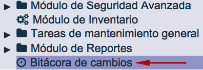
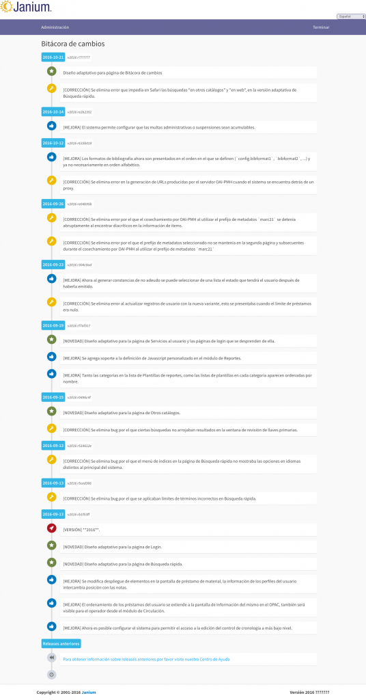

# Bitácora de cambios

Esta función del módulo de Administración permite acceder a las **descripciones de mejoras, adiciones o correcciones implementadas en el sistema Janium**, que serán mencionadas brevemente aquí, incluyendo información como el tipo de cambio, la fecha de realización y el número de versión del sistema a la que pertenece.

