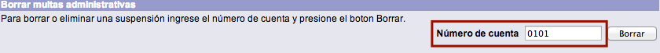
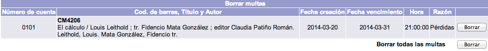
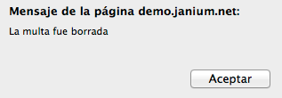
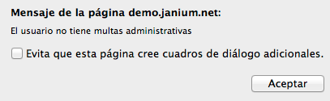

# Borrado de multas administrativas

La institución puede determinar borrar las sanciones administrativas relacionadas con un usuario. Al registrar esta acción, el usuario multado vuelve a tener su estado **OK** y _puede solicitar de nuevo materiales en préstamo_.

El procedimiento a seguir es el siguiente:

- Hacer clic sobre la opción **Multas** de la barra de herramientas del módulo.

- Escribir el _número de cuenta del usuario_ en el campo de texto de la sección *Borrar multas administrativas*. Hacer clic en el botón **Borrar**.

- El sistema muestra la lista de suspensiones asociadas al usuario. Hacer clic en el botón **Borrar** de aquella que se quiera eliminar.

- Después de la acción anterior, aparece el mensaje informando del borrado de la multa. Hacer clic en el botón **Aceptar**.

- Y, para finalizar, el mensaje confirmando que el usuario no tiene asignada ningún tipo de sanción (_si es el caso_). Hacer clic en el botón **Aceptar**.

