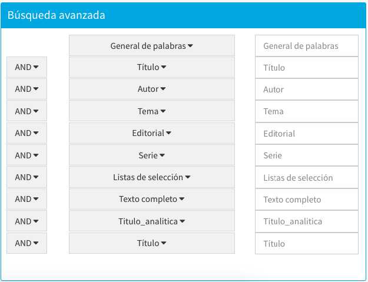

# Búsqueda avanzada en Control bibliográfico

De la misma forma que ocurre para el Catálogo al público, desde este módulo también se puede acceder a la función de *Búsqueda avanzada*.

### Elementos de la sección
#### Búsqueda por número

Formada por un *campo de texto* donde se introduce el dato a buscar y un listado desplegable de *opciones de búsqueda numérica* que pueden configurarse a medida de la institución.

Las opciones presentadas son las siguientes:

- **Cod. barras**: código de barras. Usado para identificar a los ejemplares de cara a su colocación física en los fondos de una institución o para permitir la ejecución de inventarios.

- **No. control**: número de control. Asignado por la biblioteca a cada uno de los registros bibliográficos para su identificación posterior. Suele interpretarse como el número asignado por la institución de acuerdo a su política de creación de registros en el sistema (pudiendo ser números diferentes dependiendo de los formatos o las colecciones).

- **No. adquisición**: número de adquisición del material, puede ser diferente al número de código de barras; este número suele ser asignado por el área de Adquisiciones de la institución que no es propiamente el área que asigna los códigos de barras.

- **Clasif.**: número de clasificación documental asignado al registro de ejemplar.

- **Clasif (Bib)**: número de clasificación documental asignado al registro bibliográfico.

- **ISBN**: número internacional normalizado de libros (International Standard Book Number).

- **ISSN**: número internacional normalizado de publicaciones seriadas (International Standard Serial Number).

- **No. de ficha**: número de identificación interna asignado por el sistema de manera automática en el momento de la creación de un registro bibliográfico.

- **No. ITEM**: número de identificación interna asignado por el sistema de manera automática en el momento de la creación de un registro de ejemplar.

En este contexto, en las búsquedas numéricas **por código de barras**, cuando se restringe _por una sola biblioteca_, el sistema aplica la configuración de **máscaras y prefijos de entrada de datos** que se haya definido para ella.

#### Búsqueda por índices

Es posible llevar a cabo una búsqueda avanzada utilizando hasta ocho índices de forma simultánea. Para ello, se deben escribir los términos en los cuadros de texto asignados; términos que además pueden relacionarse entre ellos a través de la lista de operadores booleanos (AND, OR y NOT). Por omisión, el sistema Janium aplica el operador AND.

Además, se debe destacar que los índices son **intercambiables**, esto es, en las listas desplegables puede elegirse varias veces el mismo tipo de índice (por ejemplo, Autor, si se desea buscar por varios autores al mismo tiempo).

Un detalle importante es que la búsqueda por número y la búsqueda por índices son procesos **excluyentes**, por lo que no pueden ejecutarse a la vez. En este sentido, en el caso de que exista información en ambos apartados, el sistema realiza una _búsqueda por número_ por defecto.

#### Limitadores de búsqueda

Al igual que en búsqueda rápida, aquí también se permite precisar la búsqueda aplicando criterios relacionados con formato, biblioteca, colección, material y estado.

### Soporte de Javascript personalizado

Tanto para las funciones de **Búsqueda rápida** como de **Búsqueda avanzada** se puede hacer uso de Javascript personalizado para los casos donde el cliente solicita alguna configuración que no es posible realizar directamente a través de la modificación de parámetros del sistema o mediante la utilización de estilos CSS.

Un ejemplo de aplicación de esto sería:

*Ocultar el índice Listas de alerta de la página de Búsqueda avanzada:*

En la página de búsqueda avanzada se muestra automáticamente un renglón de la forma de búsqueda por cada índice de palabra clave configurado. Si no se desea desactivar o eliminar un índice, sino solamente eliminarlo de la forma, se debe recurrir a un ajuste vía Javascript.