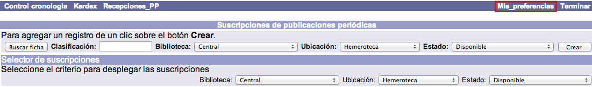
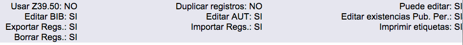

# Configuración de preferencias de Publicaciones periódicas

En los distintos procesos que se pueden llevar a cabo en el módulo de Publicaciones periódicas intervienen diferentes parámetros y valores. Estos elementos pueden establecerse **por omisión**, como parte de las preferencias del operador, facilitando así los procesos de trabajo y evitando tareas repetitivas.

El procedimiento a seguir es el siguiente:

Hacer clic sobre la opción **Mis preferencias** de la barra de herramientas del módulo.

En la pantalla que se muestra, elegir las preferencias para el operador en cuestión. Las opciones que se pueden definir son:

- *Nivel de acceso:* si se ingresa un valor numérico aquí, todas las suscripciones que cree el operador tendrán ese nivel de acceso y sólo los operadores que tengan asociado ese mismo nivel o mayor podrán verla y editarla.

- *No. de piezas:* si habitualmente cada fascículo de una publicación se compone de más de una unidad, puede introducirse aquí un valor numérico para que siempre que el operador cree una suscripción, se inserte ese número por defecto en el campo _No. de piezas_ de la misma.

- *Biblioteca:* si un operador sólo crea suscripciones para una biblioteca específica, se puede seleccionar el valor aquí.

- *Formato:* cuando un operador usa la opción de búsqueda rápida del sistema, puede aparecer por defecto el valor elegido aquí. Este campo forma parte de las _Opciones del catalogador_ definidas en el módulo de Administración, por lo que afecta también a los operadores del **módulo de Control bibliográfico**.

- *Ubicación:* puede definirse el valor por omisión aquí.

- *Estado:* puede definirse el valor por omisión aquí.

- *Tipo de material:* puede definirse el valor por omisión aquí.

- *Categoría 1* y *Categoría 2:* cada suscripción y cada fascículo tienen asociadas dos categorías de tipo estadístico. Aquí pueden seleccionarse los dos valores que van a aparecer por defecto al crear dichos registros.

- *Moneda:* puede definirse el valor por omisión aquí (_relacionado con el módulo de Adquisiciones_).

- *Foco en búsquedas numéricas:* cuando un operador realice la búsqueda numérica de una publicación, el valor indicado aquí aparecerá marcado por omisión.

- *Foco en recepción de fascículos:* al usar la función **Recepciones\_PP**, el valor seleccionado aquí se establecerá como opción de búsqueda predeterminada de la publicación.

- *Búsqueda por omisión en:* biblioteca por defecto en la que se buscarán las publicaciones periódicas.

- *Desplegar en OPAC:* aquí se establece si se desea que se muestren por omisión en el catálogo al público las existencias asociadas a una suscripción creada.

- *Ítem puede circular:* aquí se establece si los ítems creados a partir de fascículos recibidos pueden circular o no, por defecto.

- *Ítem es permanente:* los registros de ítems tienen un campo donde se indica si son permanentes. Si se desea asignar un valor por omisión para los ítems que se creen al recibir, se indica aquí.

- *Activar existencias MARC pub. per. :* si se van a crear existencias MARC de los fascículos recibidos, se selecciona el valor SI en este campo, para que aparezca por omisión en las suscripciones que se van a crear.

- *Crear ítems desde pub. per. :* si se van a crear registros de ítems por cada fascículo recibido, se selecciona el valor SI en este campo, para que aparezca por omisión en las suscripciones que se van a crear.

Además de los elementos que se acaban de explicar, en la pantalla de preferencias también aparecen, en su parte inferior, algunas opciones definidas previamente en las _Opciones del catalogador_, dentro del módulo de Administración. Estos valores pueden ser útiles **para mantener informado al operador sobre las funciones que puede o no llevar a cabo**.

Son las siguientes:

- *Usar Z39.50:* indica si el operador puede hacer búsquedas en otros catálogos mediante este protocolo.

- *Duplicar registros:* indica si el operador puede duplicar registros bibliográficos, de autoridades y de existencias MARC.

- *Puede editar:* indica si el operador puede modificar registros bibliográficos, de autoridades y de existencias MARC.

- *Editar BIB:* indica si el operador puede modificar registros bibliográficos.

- *Editar AUT:* indica si el operador puede modificar registros de autoridades.

- *Editar existencias Pub. Per. :* indica si el operador puede modificar existencias MARC de publicaciones periódicas.

- *Exportar registros:* indica si el operador puede exportar registros internos desde la base de datos.

- *Importar registros:* indica si el operador puede importar registros externos a la base de datos.

- *Borrar registros:* indica si el operador puede borrar registros de la base de datos.

- *Imprimir etiquetas:* indica si el operador puede realizar la impresión de etiquetas de lomo / tejuelos, bolsillo o código de barras para los materiales.

