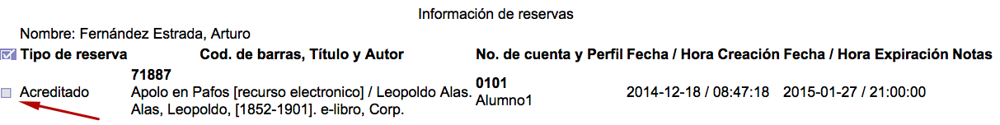

# Consulta y edición de apartados / reservas

Para proceder a la consulta y posible edición de la información relacionada con los materiales apartados / reservados de un usuario, se accede a la siguiente pantalla:

Si se hace clic sobre el **cuadro selector** situado en la parte izquierda de cada una de las entradas (o en el cuadro selector general, para elegirlas todas a la vez), el sistema muestra el formulario para modificar los datos que se deseen o incluso borrar el registro completo:

