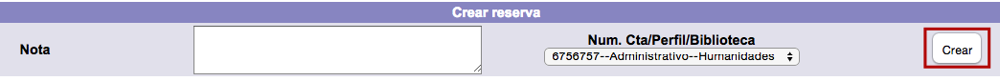

# Creación de apartados / reservas

En relación con el proceso de creación de apartados / reservas, es en esta pantalla donde se puede escribir una nota informativa acerca de esta acción, antes de terminar el proceso.

Finalmente, hacer de nuevo clic sobre el botón *Crear* para que el sistema despliege el mensaje ***El apartado de material fue realizado***. Hacer clic en el botón **Aceptar**.

