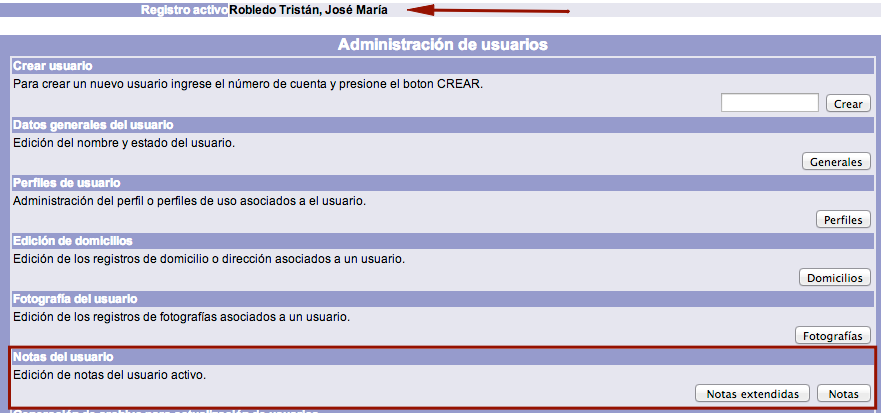
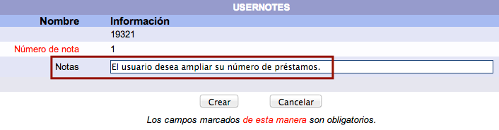

# Creación de notas para usuario

Estas notas informativas son **privadas**, es decir, no pueden ser vistas por los usuarios desde el catálogo al público. La intención de ellas es incluir datos relevantes que los operadores del módulo deban tener en cuenta. Las notas se despliegan en las funciones de **préstamo**, **devolución** y **despliegue del usuario**.

El procedimiento a seguir es el siguiente:

- Hacer clic sobre la opción **Usuarios** de la barra de herramientas del módulo.

- Buscar al usuario en cuestión por _ID del usuario_, _número de cuenta / identificador alterno_ o _nombre_.

- Teniendo al usuario como **registro activo**, hacer clic en el botón **Notas** de la sección *Notas del usuario*.

- Se despliega la pantalla de creación de notas para el usuario activo. Escribir el _número de orden_ (no es necesario que la numeración sea consecutiva) en el campo de texto correspondiente y hacer clic sobre el botón **Crear**.

- El sistema muestra la pantalla *USERNOTES*, en la que se debe introducir el texto deseado para la nota en el campo destinado para ello y hacer clic sobre el botón **Crear**.

