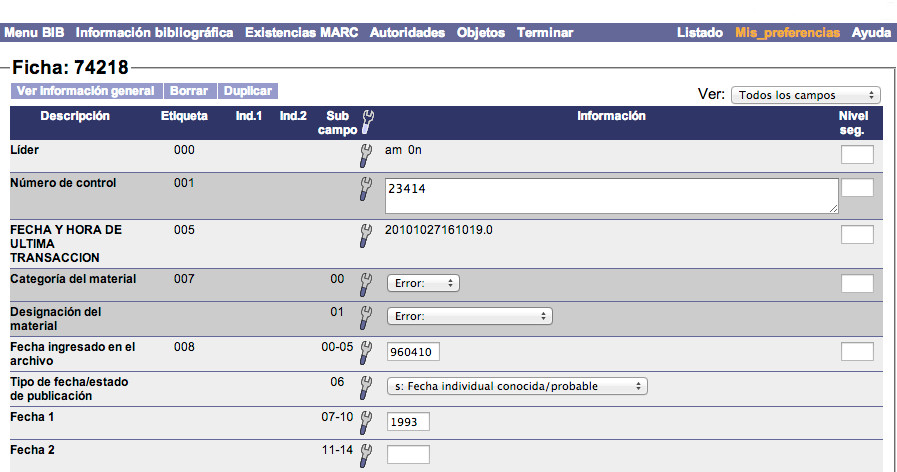
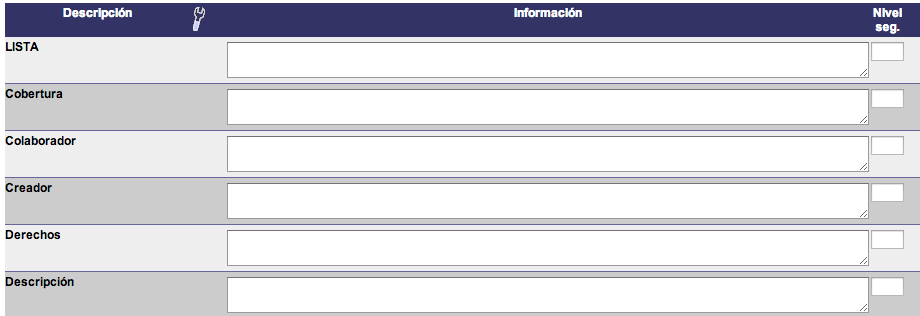
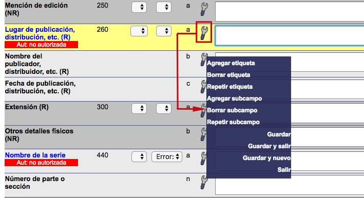

# Creación y edición de registros bibliográficos

Por lo general, un nuevo registro bibliográfico se crea cuando:

- El título no ha sido capturado previamente.
- No se ha capturado una edición diferente del título.
- No fue localizado en otros catálogos.

Como ya se ha mencionado, el paso previo a la creación de un registro bibliográfico es la selección del _formato_ del material, que determina a su vez la plantilla, y de la _biblioteca catalogadora_.

Una vez realizada esta acción y tras hacer clic en el botón *Crear*, se despliega la plantilla correspondiente. Es en este punto cuando el sistema asigna el **número de ficha** al registro creado. Este número es de carácter único, lo que significa que si el registro fuera borrado no se asignaría el mismo a uno nuevo.

### Elementos de la plantilla
#### Información general

Al crear o editar un registro este elemento no está desplegado por defecto. Para hacerlo, es necesario hacer clic en el botón *Ver información general* situado justo debajo del número de ficha.

Esta sección tiene los siguientes campos:

- **No. control:** número de control del registro asignado por la institución. Sirve como dato de recuperación en la búsqueda avanzada a través de la búsqueda numérica. Su uso es _opcional_, por lo que este campo puede no contener información.

- **Biblioteca:** biblioteca responsable de la creación y recogida de la información en el registro, llamada también *Biblioteca catalogadora*.

- **Formato:** estructura de datos utilizada para crear el registro. Determina por lo tanto los campos que serán usados para introducir la información.

- **Nivel de acceso:** valor numérico que establece el nivel de acceso mínimo que el usuario debe tener para poder desplegar el registro en el catálogo al público. Este campo puede no tener ningún número lo que significa que cualquier usuario podrá desplegarlo.

- **Creado por:** número de cuenta del operador responsable de la creación del registro.

- **Fecha creación:** fecha de creación del registro en formato AAAAMMDD.

- **Modificado por:** número de cuenta del operador responsable de la última modificación realizada en la información del registro.

- **Fecha modificación:** fecha de la última modificación realizada en la información del registro en formato AAAAMMDD.

Los campos _No. control_, _Biblioteca_, _Formato_ y _Nivel de acceso_ pueden ser modificados por el operador del módulo. Los campos _Creado por_, _Fecha creación_, _Modificado por_ y _Fecha modificación_ son controlados por el módulo y no pueden ser modificados por el operador.

Al realizar algún cambio en esta sección, el operador debe confirmar la acción haciendo clic en el botón *Actualizar*.

#### Columnas

La plantilla presenta las siguientes columnas:

- **Descripción:** término descriptivo del campo de catalogación.
- **Etiqueta:** número representativo del campo de catalogación.
- **Ind. 1:** indicador 1 relacionado con el campo *Etiqueta*.
- **Ind. 2:** indicador 2 relacionado con el campo *Etiqueta*.
- **Subcampo:** elemento identificador relacionado con el campo *Etiqueta*.
- **Icono de herramienta:** imagen orientativa que da acceso al menú contextual de opciones para cada campo de la plantilla.
- **Información:** campo de texto o selección donde se registra la información descriptiva del material.
- **Nivel seg:** valor numérico para establecer el nivel de acceso mínimo que los usuarios deben tener asignado para desplegar la información del campo concreto.

Dependiendo del formato elegido, algunos de estos elementos pueden aparecer o no (como _etiqueta_, _ind. 1_, _ind. 2_ o _subcampo_). Por ejemplo, el formato Dublin Core no tiene indicadores, etiquetas ni subcampos, por lo que en su plantilla sólo constan _descripción_, _imagen de herramienta_, _información_ y _nivel de seguridad_.

#### Menú contextual de opciones

Como se acaba de describir, uno de los elementos de la plantilla es el **icono de herramienta**, que despliega el menú contextual de opciones para todos los campos al colocar el puntero del ratón sobre cualquiera de estas imágenes.

Las opciones que aparecen en el menú contextual son las siguientes:

- **Agregar etiqueta:** al hacer clic sobre esta opción, se despliega una ventana emergente con la lista de etiquetas definidas que pueden añadirse a la plantilla. Para seleccionar una de ellas, se puede pinchar en el número de la etiqueta que se quiere agregar o bien escribir dicho número en el campo de texto _Etiqueta_, situado en la parte superior derecha y después hacer clic en el botón *Aceptar*.

- **Borrar etiqueta:** permite borrar el campo seleccionado, subcampos incluidos. Este tipo de opciones, al igual que *Borrar subcampo*, no modifican el diseño de la plantilla. Es decir, _no borran definitivamente la etiqueta de todos los registros_, sino sólo del que se está creando o editando.

- **Repetir etiqueta:** permite repetir el campo seleccionado. La nueva etiqueta se agrega justo debajo de la usada como referencia para la repetición. Al igual que en el caso anterior, estas opciones tampoco modifican el diseño de la plantilla.

- **Agregar subcampo:** como sucede con *Agregar etiqueta*, al hacer clic sobre esta opción también se muestra una ventana emergente con la lista de subcampos definidos que pueden añadirse en la plantilla. Sin embargo, la diferencia aquí radica en que _la lista mostrada está asociada a la etiqueta donde se quiere añadir el subcampo_.

- **Borrar subcampo:** permite borrar el elemento seleccionado. No se borrará la etiqueta a la que pertenece, excepto cuando sea el único subcampo desplegado en ella.

- **Repetir subcampo:** permite repetir los subcampos _definidos como repetibles_. Al presionar esta opción, se despliega un campo de texto donde se escribe el código del subcampo que se desea repetir. Después de escribir el código se da clic en el botón *Aceptar* para ejecutar la acción.

- **Guardar:** permite guardar la información introducida sin tener que salir de la plantilla, si la intención es continuar agregando más datos.

- **Guardar y salir:** guarda la información introducida y sale de la plantilla. Después de esta acción, se despliega la vista en detalle del registro, tal y como se va a ver en el catálogo al público.

- **Guardar y nuevo:** guarda el registro activo en el editor, crea uno nuevo con el mismo formato, en la misma biblioteca y comienza su edición.

- **Salir:** permite salir de la plantilla sin guardar la información editada.

- **Ayuda:** despliega la ayuda contextual de la etiqueta o subcampo seleccionado. Este punto puede ser configurado por la institución.

**NOTA:** en este contexto, se debería verificar que el navegador utilizado permita el despliegue de las ventanas emergentes que genera el sistema Janium. A veces, los navegadores muestran un aviso que indica que se evitó el despliegue de estas ventanas y es necesario autorizar la acción.

### Edición de “información general” desde *Detalle*

Es posible configurar el sistema para que permita que los catalogadores revisen y modifiquen la información de control (o **información general**) de los registros bibliográficos desde la página de *Detalle*, sin tener que entrar necesariamente a la plantilla para tal propósito.

Si el sistema está configurado para ello, en la pantalla de *Detalle* se podrá observar una nueva pestaña: **“Ver información general”**.

Al hacer clic sobre ella aparecerá la sección desplegada, justo como lo hace en la plantilla:

De igual modo, la sección puede ocultarse haciendo clic nuevamente en “Información general”.

**Notas aclaratorias sobre esta función:**

- Su presencia no altera en absoluto el comportamiento actual de las plantillas, con su propia sección de edición.
- En ella aplican las mismas restricciones de seguridad y opciones de catalogador que aplican en las plantillas.