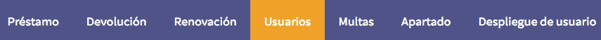
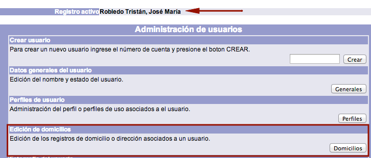
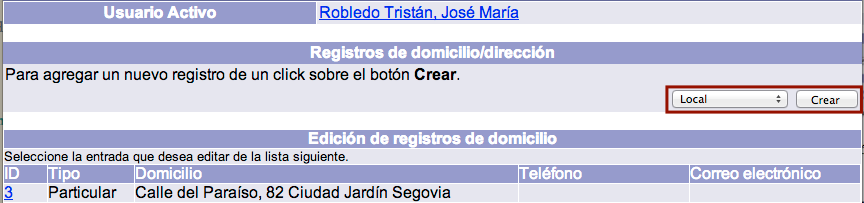
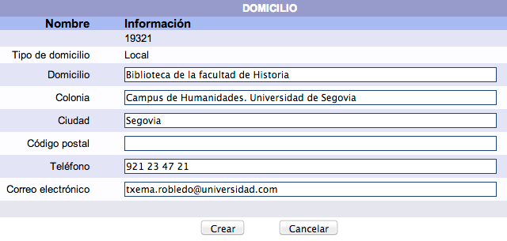
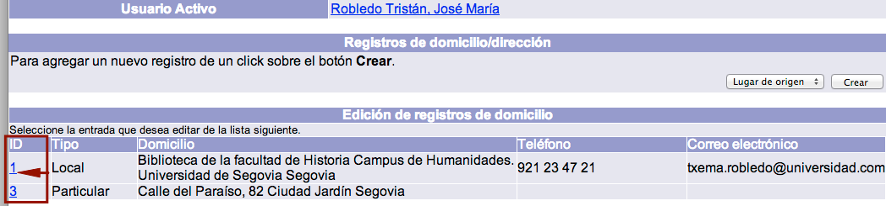
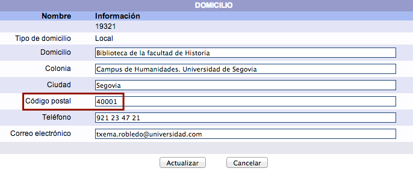
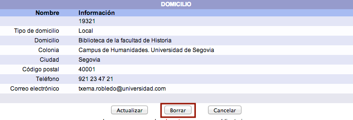

# Gestión de domicilios
## Asignación de domicilios

En el sistema Janium, es posible registrar la información de hasta **cuatro domicilios** para un mismo usuario. En este sentido, el sistema establece cuatro categorías:

- **Local:** para los usuarios que trabajan en la propia institución, se recogen los datos de localización de la persona dentro de la misma (área, departamento, dirección, sección, edificio, número de teléfono, extensión, etc.).

- **Lugar de origen:** para los usuarios cuyo lugar de origen es diferente al lugar (ciudad o país) donde se encuentra la institución.

- **Particular:** para los usuarios cuyo lugar de origen es igual al lugar donde se encuentra la institución, pero _no trabajan en ella_.

- **Temporal:** para los usuarios que no residen en el mismo lugar (ciudad, país) de la institución y sólo serán usuarios por un tiempo específico. Es decir, son _visitantes_.

El procedimiento a seguir es el siguiente:

- Hacer clic sobre la opción **Usuarios** de la barra de herramientas del módulo.

- Buscar al usuario en cuestión por _ID del usuario_, _número de cuenta / identificador alterno_ o _nombre_.
- Teniendo al usuario como **registro activo**, hacer clic en el botón **Domicilios** de la sección *Edición de domicilios*.

- Se despliega la pantalla de gestión de domicilios para el usuario activo. Elegir el _tipo de domicilio_ que se desea crear y hacer clic sobre el botón **Crear**. (Es necesario tener en cuenta que no es posible crear **dos domicilios del mismo tipo**)

- Escribir los datos correspondientes y hacer clic en el botón **Crear**.

## Modificación de domicilios

El sistema Janium también permite realizar cambios en la información registrada en el domicilio (o domicilios) del usuario.

El procedimiento a seguir es el siguiente:

- Hacer clic sobre la opción **Usuarios** de la barra de herramientas del módulo.

- Buscar al usuario en cuestión por _ID del usuario_, _número de cuenta / identificador alterno_ o _nombre_.
- Teniendo al usuario como **registro activo**, hacer clic en el botón **Domicilios** de la sección *Edición de domicilios*.

- Se despliega la pantalla de gestión de domicilios para el usuario activo. Hacer clic sobre el **ID** del domicilio cuyos datos se desean modificar.

- En el formulario de edición, realizar los cambios correspondientes y hacer clic en el botón **Actualizar**.

## Borrado de domicilios

Si fuera necesario, es posible borrar una dirección específica del registro del usuario.

El procedimiento a seguir es el siguiente:

- Hacer clic sobre la opción **Usuarios** de la barra de herramientas del módulo.

- Buscar al usuario en cuestión por _ID del usuario_, _número de cuenta / identificador alterno_ o _nombre_.

- Teniendo al usuario como **registro activo**, hacer clic en el botón **Domicilios** de la sección *Edición de domicilios*.

- Se despliega la pantalla de gestión de domicilios para el usuario activo. Hacer clic sobre el **ID** del domicilio cuyos datos se desean borrar.

- En el formulario de edición, hacer clic en el botón **Borrar** para ejecutar la acción (_el sistema pedirá confirmación de la misma_).

