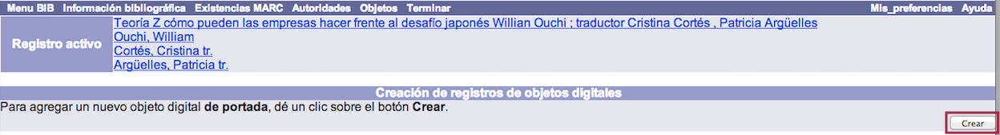
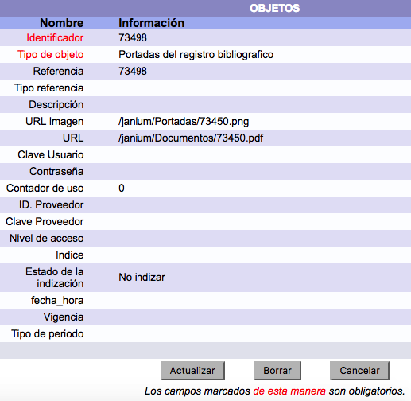
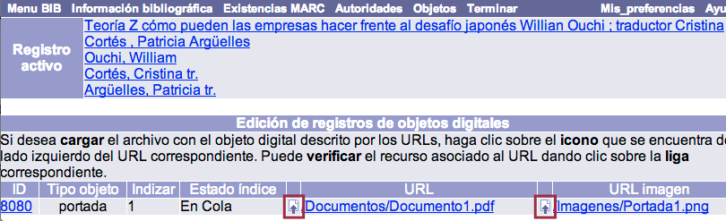
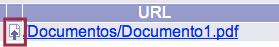
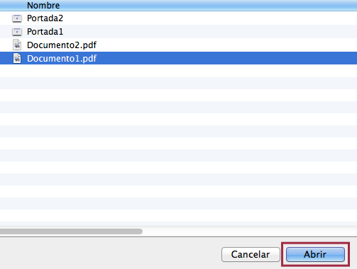
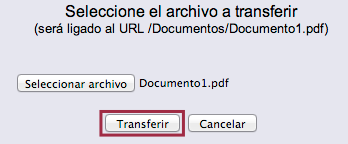
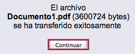
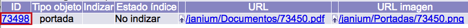

# Gestión de objetos digitales

El proceso de vinculación de un archivo electrónico con un registro bibliográfico o de ejemplar ofrece la posibilidad de **visualizar dicho archivo a través del catálogo al público**, en forma de objeto digital asociado. Además, si cumple con los requisitos necesarios, puede ser indizado por el sistema y recuperado a través del índice *Texto completo*.

Para llevar a cabo este proceso se necesitan tres elementos previos: el registro (_bibliográfico o de ejemplar)_ al cual ser vinculará el objeto digital, la _imagen_ que representará al objeto digital en el catálogo al público y el _archivo electrónico_ que será vinculado.

Existen dos tipos de objetos digitales, que determinan, a su vez, dos procedimientos de gestión distintos:

- **Objetos digitales de portada**, vinculados a registros bibliográficos.
- **Objetos digitales de ítem**, vinculados a registros de ejemplar.

### Procedimiento de creación y vinculación de objetos digitales de portada

- Buscar y desplegar el registro bibliográfico al cual se vinculará el objeto digital, usando la opción *Búsqueda rápida* o *Búsqueda avanzada* del menú principal del módulo.

- Una vez desplegado el registro, hacer clic en la opción **Objetos** de la barra de herramientas del módulo. Se accede a la pantalla de *Creación de registros de objetos digitales*.

- En esta pantalla, hacer clic en el botón **Crear**. Se despliega la ficha para la creación del objeto digital.

- Editar los campos del registro con los valores correspondientes, teniendo en cuenta que los establecidos en color rojo son de tipo _obligatorio_. Al finalizar, hacer clic en el botón **Actualizar**. Se muestra la pantalla de *Edición de registros de objetos digitales* donde constan los valores definidos en los campos Indice, URL y URL imagen.

_Lista detallada de campos_

**Identificador:** número automático asignado al objeto digital. Es igual al número de ficha asignado al registro bibliográfico. No debe ser borrado o modificado.

**Tipo de objeto:** corresponde al tipo de objeto digital que se está creando, en este caso debe ser “Portadas del registro bibliográfico”. 

**Referencia:** número automático asignado al objeto digital. Por omisión, coincide con el valor del campo *Identificador*, pero en este caso el número puede ser borrado o modificado por el operador. 

**Tipo referencia:** reservado para utilizarse en versiones futuras del sistema.

**Descripción:** explicación breve sobre el objeto digital.

**URL imagen:** ruta y nombre de la imagen que es almacenada en el servidor y vinculada al registro, y que  lo representa en el catálogo al público. La ruta se corresponde con la dirección del directorio donde se encuentre alojada la imagen. El nombre de la misma debe ser escrito incluyendo la extensión. Además, el elemento **/janium/** debe incluirse obligatoriamente al inicio de la ruta.

**URL:** ruta y nombre del archivo electrónico que es almacenado en el servidor y vinculado al registro. La ruta se corresponde con la dirección del directorio donde se encuentre alojado el archivo. El nombre del mismo debe ser escrito incluyendo la extensión. Además, el elemento **/janium/** debe incluirse obligatoriamente al inicio de la ruta.

**Clave Usuario:** reservado para utilizarse en versiones futuras del sistema.

**Contraseña:** reservado para utilizarse en versiones futuras del sistema.

**Contador de uso:** reservado para utilizarse en versiones futuras del sistema.

**ID. Proveedor:** reservado para utilizarse en versiones futuras del sistema.

**Clave Proveedor:** reservado para utilizarse en versiones futuras del sistema.

**Nivel de acceso:** valor numérico jerárquico que determina el nivel de acceso mínimo que el usuario debe tener para poder acceder al objeto digital.

**Indice:** número que determina la posibilidad de indizar el objeto digital, en el índice *Texto completo*, en caso de ser un archivo de texto. El valor **1** significa que debe ser indizado; el valor **0** significa que no será indizado por el sistema.

**Estado de la indización:** campo que se corresponde de forma directa con el anterior y que es actualizado automáticamente conforme avanza el proceso de indización por parte del sistema. Los valores son: *No indizar*, *Indizado*, *Error en índice* y *En cola*.

**fecha\_hora:** fecha y hora de indización del objeto digital por el sistema.

**Vigencia:** valor numérico que determina la cantidad de tiempo que debe transcurrir para que el objeto digital sea indizado de nuevo, si se decide establecer esta condición. Este campo está directamente relacionado con el que se indica a continuación.

**Tipo de periodo:** tipo de periodo que, junto al valor definido en el campo Vigencia, determina la cantidad de tiempo que debe transcurrir para que el objeto digital sea indizado de nuevo por el sistema. Los valores son: *Días*, *Meses*, *Años* e *Indefinido*.

**NOTA ACLARATORIA:**

- Es posible configurar el sistema para permitir la **entrada inmediata al modo de edición** de un objeto digital (ya sea de portada o de ítem) desde la página de *Detalle*. De esta forma, al hacer clic sobre el botón *Crear* o sobre el vínculo asociado al ID del objeto a editar, se entrará primero a la interfaz _en modo de sólo lectura_, como sucede por defecto, pero de inmediato el sistema dará paso a la pantalla de edición.

### Transferencia de los objetos digitales al servidor

Una vez que se hace clic en Actualizar, se despliega la pantalla de *Edición de registros de objetos digitales*, mencionada anteriormente, donde se presenta la información recogida en los campos **URL** y **URL_imagen**. A la izquierda de cada uno de ellos se encuentra el botón *Subir objeto*.

En relación con el campo _URL_, la finalidad de este botón es transferir el **archivo electrónico** que será vinculado al objeto digital, mientras que para el campo _URL imagen_ sirve para transferir la **imagen** que va a representar al objeto digital.

Para explicar el procedimiento de transferencia se ha tomado como ejemplo un registro bibliográfico, pero los pasos a seguir son los mismos para un registro de ejemplar. Por otro lado, también se ha tomado como referencia para la explicación el campo URL, teniendo en cuenta que para URL imagen debe seguirse el mismo procedimiento:

- Hacer clic en el botón **Subir objeto**. Se abre una ventana emergente mediante la que poder seleccionar el archivo electrónico a transferir.

- En la ventana emergente desplegada, hacer clic en el botón **Seleccionar archivo**. Se muestra el explorador de archivos del equipo local.

- Dentro del explorador, buscar y seleccionar el archivo que va a ser vinculado como objeto digital al registro. Hacer clic en el botón **Abrir** (o **Aceptar**).

- De vuelta a la ventana emergente, en la que ahora aparecen los datos del archivo elegido, hacer clic en el botón **Transferir** para dar comienzo al proceso de subida del archivo al servidor, por parte del sistema.

- Después de unos momentos, se muestra el mensaje de que el archivo ha sido transferido con éxito. Para finalizar el procedimiento, hacer clic en el botón **Continuar**.

**IMPORTANTE:** en el caso de que algo no funcionase durante este procedimiento o se quisiera cambiar la configuración del objeto digital de algún modo, se debe hacer clic en el número que aparece en la columna ID, para así ingresar en el modo de edición que ya se ha mostrado con anterioridad.

