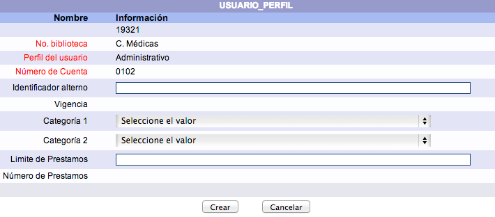

# Gestión de perfiles de usuario

Esto se lleva a cabo cuando un usuario tiene **diferentes roles** dentro de una institución y, por lo tanto, necesita distintos perfiles para interactuar con el sistema, con sus características propias cada uno de ellos.

Por ejemplo, en una universidad, una persona puede ser _trabajador administrativo_ y, a la vez, _profesor_. O bien, _profesor de licenciatura_ y _alumno de posgrado_ al mismo tiempo.

El procedimiento a seguir es el siguiente:

- Hacer clic sobre la opción **Usuarios** de la barra de herramientas del módulo.

- Buscar al usuario en cuestión por _ID del usuario_, _número de cuenta / identificador alterno_ o _nombre_.

- Teniendo al usuario como **registro activo**, hacer clic en el botón **Perfiles** de la sección *Perfiles de usuario*.

- Se despliega la pantalla de gestión de perfiles para el usuario activo. Escribir el _número de cuenta del usuario_ al que asociar el nuevo perfil, la _biblioteca_ encargada de los servicios y el _tipo de perfil_ deseado. Hacer clic en el botón **Crear**.

- El sistema muestra la pantalla **USUARIO\_PERFIL**, donde es necesario introducir los datos requeridos. Hacer clic en el botón **Crear**.

