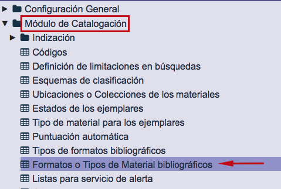
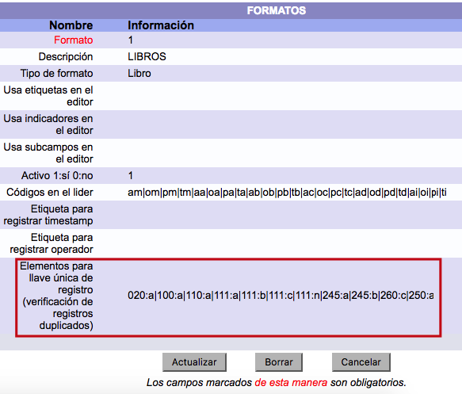
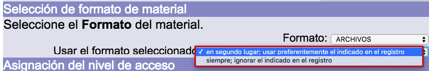

# Importación de registros bibliográficos

En el sistema Janium se pueden importar registros que se encuentren en los siguientes formatos:

**ISO 2709:** es una norma internacional para la descripción bibliográfica, que tiene por título *Format for Bibliographic Information Interchange on Magnetic Tape*. Consta de cuatro secciones:

- _Cabecera de registro_: los primeros 24 caracteres del mismo. Es la única parte de extensión fija. Incluye la longitud del registro completo y la dirección inicial la información contenida. También contiene datos que señalan cuántos caracteres se usan para los indicadores y para los identificadores de subcampos.

- _Directorio_: provee la posición inicial de los campos en el registro, junto con las etiquetas de campos. Consta de cuatro partes que no pueden exceder los nueve caracteres de largo: etiqueta, longitud, posición del primer carácter y una parte opcional definida en la implementación.

- _Campo de datos_: una cadena de caracteres que contiene todos los campos y subcampos del registro: campo identificador del registro, campos reservados y campos bibliográficos.

- _Separador de registros_: un simple carácter (IS3 de ISO 646).

Para conocer más en profundidad la estructura general de registros que debe aplicarse, puede consultarse la [información recogida por la Biblioteca del Congreso](http://www.loc.gov/marc/specifications/specrecstruc.html).

**ASCII:** en este caso, es posible importar un fichero en formato FLAT, codificado con caracteres ASCII. Un fichero FLAT está formado por filas de longitud constante separadas por *intros*, y un conjunto de datos por fila separados por *espacios en blanco*.

Por su parte, ASCII (acrónimo de *American Standard Code for Information Interchange*) es un código de caracteres basado en el alfabeto latino, tal y como se usa en inglés moderno y en otras lenguas occidentales.

### Opciones para carga de duplicados / consolidación

Las opciones de configuración que intervienen en el proceso de tratamiento de los registros bibliográficos duplicados durante la importación de los mismos son las siguientes:

- **Descartar+items:** si está activa, al intentar importar un registro que ya se encuentra en la base de datos (_considerando la llave de unicidad_), éste no es importado y se agregan al ya existente los ejemplares que puedan venir asociados al nuevo.

- **Descartar:** si está activa, al intentar importar un registro que ya se encuentra en la base de datos (_considerando la llave de unicidad_), ni éste ni sus ejemplares asociados son importados.

- **Permitir:** si está activa, al intentar importar un registro que ya se encuentra en la base de datos (_considerando la llave de unicidad_), éste es importado como un registro nuevo, incluyendo sus ejemplares asociados.

- **Reemplazar:** si está activa, al intentar importar un registro que ya se encuentra en la base de datos (_considerando la llave de unicidad_), se reemplaza la información del ya existente por la del nuevo, añadiendo sus ejemplares.

La función *Consolidar ítems* cuenta con dos variantes:

- **Sí:** si está activa, al intentar importar un ejemplar que ya se encuentra en la base de datos (_considerando el código de barras y la biblioteca_), se reemplaza la información del ya existente por la del nuevo. En el caso de que el código de barras sea igual pero la biblioteca distinta, el ejemplar se agrega con un código de barras asignado de forma automática.

- **No:** si está activa, al intentar importar un ejemplar que ya se encuentra en la base de datos (_considerando el código de barras y la biblioteca_), se carga como un registro nuevo al que se le agrega un código de barras de forma automática.

### Llaves de unicidad

La adecuada configuración de este elemento es esencial para permitir una identificación adecuada de los registros duplicados, antes de que estos pasen a formar parte de la base de datos. La definición de las llaves de unicidad se realiza por **formatos** o **tipos de materiales bibliográficos**. De esta forma, cada uno de ellos puede tener una configuración diferente.

A continuación, se describen varios ejemplos de la mencionada configuración:

- Se escribe el campo seguido del subcampo a considerar separado por _dos puntos_:

245:a

- Para separar dos campos es necesario separarlos con _*pipe*_ (**|**):

245:a|245:b

245:a|260:c|250:a

- Si se desean utilizar únicamente los caracteres alfabéticos de un subcampo, se debe escribir **\*A\*** después del subcampo:

111:a(*A*)|245:a

- Si se desean utilizar únicamente los caracteres numéricos de un subcampo, se debe escribir **\*N\*** después del subcampo:

250:a(*N*)|260:c(*N*)

**IMPORTANTE:** esta configuración se realiza desde el módulo de Administración:

### Tipos de formato en tabla *Formatos*

Durante el proceso de importación de registros en formato MARC21, para determinar con qué tipo de formato serán integrados estos nuevos registros en la base de datos, el sistema establece una comparación tomando como referencia los dos elementos siguientes:

- Códigos que aparecen en las **posiciones 6 y 7 de la Cabecera** (o *Leader*) de los registros bibliográficos a importar. En el formato MARC21, la posición 6 equivale a _tipo de registro_; la posición 7, a _nivel bibliográfico_. 

- Códigos presentes en la **tabla *Formatos* del sistema**, para cada uno de los tipos de formato definidos.

Estos son ejemplos de algunos de los códigos que suelen presentarse:

| Posición 6       | Posición 7               |
|------------------|--------------------------|
| a                | b                        |
| Material textual | Parte componente seriada |
| a                | c                        |
| Material textual | Colección                |
| a                | m                        |
| Material textual | Monografía               |
| a                | s                        |
| Material textual | Publicación seriada      |

Por otro lado, a través del selector correspondiente puede elegirse el **formato de entrada** para aquellos casos donde el formato detectado por el sistema en los registros bibliográficos cargados no es el que se desea que tengan finalmente:

