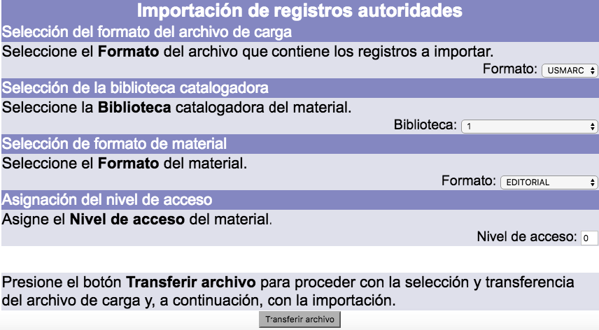
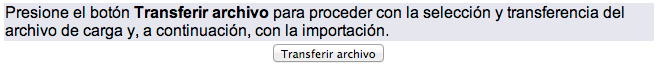
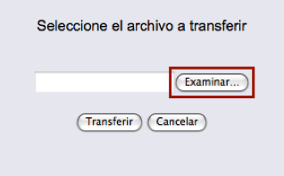

# Importación de registros de autoridad

El procedimiento de importación de registros de autoridad es el siguiente:

- En la pantalla de *Menú AUT*, hacer clic en el botón **Importar** de la sección correspondiente.

- Se despliega el menú de **Importación de registros autoridades**, cuyas opciones se detallan a continuación:

    _Selección del formato del archivo de carga:_ el archivo con los registros de autoridad debe estar en formato ISO 2709 y los datos deben estar recogidos bajo el estándar MARC21 de Autoridades.

    _Selección de la biblioteca catalogadora:_ permite elegir la biblioteca que quedará vinculada como responsable de la importación de los registros.

    _Selección de formato de material:_ permite elegir el tipo de autoridad de los registros que serán importados.

    _Asignación del nivel de acceso:_ permite asignar un valor numérico jerárquico de seguridad a los registros que serán importados.

- Después de seleccionar los valores pertinentes, hacer clic en el botón **Transferir archivo**.

- En la ventana emergente que aparece, hacer clic en el botón **Examinar** para buscar y seleccionar el archivo de registros que se desea importar.

- En la pantalla del explorador de su equipo local, elegir el archivo de registros a importar y hacer clic en el botón **Abrir** (o **Aceptar**). De regreso a la ventana emergente mencionada en el paso anterior, en cuyo campo de texto se verá ahora la ruta del archivo seleccionado, hacer clic en el botón **Transferir**.

- El sistema carga el archivo de registros de autoridad y avisa de la conclusión del proceso mediante un mensaje de confirmación. Hacer clic en el botón **Importar**.

- Para terminar, se despliega una pantalla con la lista de números de registro (o de ficha) utilizados durante la importación. En la parte inferior de esta lista aparece el mensaje ***Carga de datos finalizada***, para comunicar el final del proceso.

