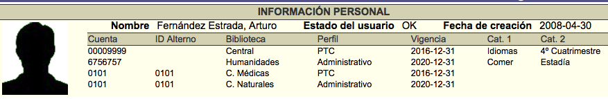
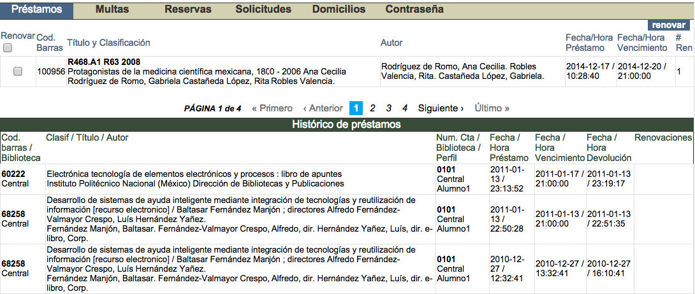
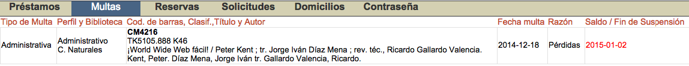
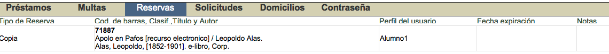
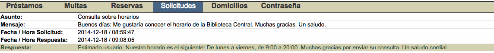
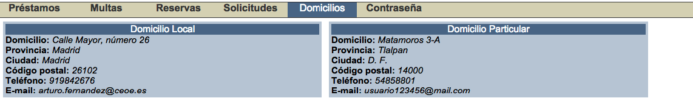
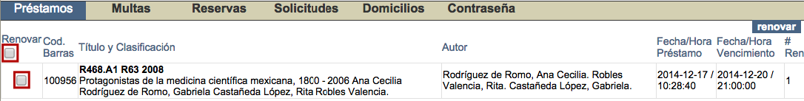
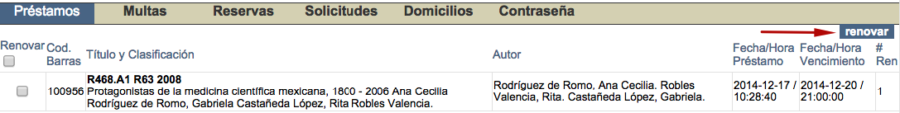

# Información del usuario

En primer lugar, para acceder a esta función es necesario identificarse en el sistema introduciendo el número de cuenta, o el identificador alterno, y la contraseña del usuario.

Una vez dentro, el usuario puede consultar sus datos de:

- Nombre.
- Estado.
- Fecha de creación del usuario en el sistema.
- Números de cuenta (o IDs alternos) asociados.
- Bibliotecas a las que pertenece.
- Perfiles que tiene asignados.
- Vigencia de cada uno de los perfiles.
- Categorías estadísticas asociadas a sus cuentas.

Además, aquí también se despliega su información relacionada con el módulo de Circulación:

- **Préstamos**, tantos los activos como el listado de los históricos.

- **Multas acumuladas.**

- **Reservas pendientes.**

- **Solicitudes realizadas.**

- **Domicilios asociados.**

- **Gestión de contraseñas.**

## Renovación de préstamos desde *Información del usuario*

Dentro de esta sección del Catálogo al público, los propios usuarios tienen la posibilidad de efectuar la renovación de sus materiales prestados.

Para llevar a cabo este proceso, estando en la opción *Préstamos*, se debe hacer clic sobre los **cuadros de selección individuales** de todos aquellos materiales que se quieran renovar, situados en la parte izquierda de la pantalla. O bien sobre el **cuadro de selección global**, para elegir todos los materiales de una vez.

Una vez hecho lo anterior, se debe hacer clic sobre el botón ***Renovar***, situado en la parte derecha de la pantalla.

