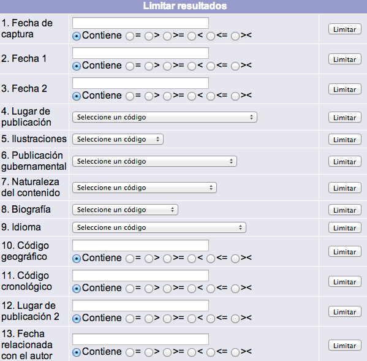

# Limitación de resultados

Después de haber hecho una búsqueda y obtener el sumario de resultados correspondientes, se puede proceder a una depuración o ajuste de los resultados. Para ello, debe usarse el botón *Limitar resultados*, explicado con anterioridad, que da paso a la siguiente pantalla:

Los elementos predeterminados de este apartado se definen a partir de la etiqueta **008** del formato MARC21, y son:

- **Fecha de captura:** campo de texto donde se escribe (en formato AAMMDD) la fecha de captura del registro bibliográfico en el sistema.
- **Fecha 1:** campo de texto donde se escribe (en formato AAAA) el año de publicación del material.
- **Fecha 2:** campo de texto donde se escribe (en formato AAAA) otra fecha relacionada con el material (año de copyright, de impresión, o cierre de publicación).
- **Lugar de publicación:** lista que despliega una serie de códigos alfabéticos y su equivalencia sobre el lugar de publicación, producción o ejecución del material.
- **Ilustraciones:** lista que despliega una serie de códigos alfabéticos y su equivalencia sobre el tipo de ilustraciones que contiene el material.
- **Publicación gubernamental:** lista que despliega una serie de códigos alfabéticos y su equivalencia sobre las características específicas del material, si es o no una publicación gubernamental y de qué nivel, en caso de serlo.
- **Naturaleza del contenido:** lista que despliega una serie de códigos alfabéticos y su equivalencia sobre el tipo de contenido de una parte significativa del material (cuando esta parte es relevante).
- **Biografía:** lista que despliega una serie de códigos alfabéticos y su equivalencia sobre las características específicas del material, si es o no una biografía y el tipo de material biográfico, en caso de serlo.
- **Idioma:** lista que despliega una serie de códigos alfabéticos y su equivalencia sobre el idioma en que se encuentra codificado el material.

Además, algunas de estas opciones de limitación cuentan con funciones asociadas que deben ser utilizadas, _pero sólo una a la vez_:

- **Contiene** se recuperarán los registros que CONTENGAN el dato ingresado en el campo de texto.
- **=** se recuperarán los registros que SEAN IGUALES al dato ingresado en el campo de texto.
- **&gt;** se recuperarán los registros que SEAN MAYORES al dato ingresado en el campo de texto.
- **&gt;=** se recuperarán los registros que SEAN MAYORES O IGUALES al dato ingresado en el campo de texto.
- **&lt;** se recuperarán los registros que SEAN MENORES al dato ingresado en el campo de texto.
- **&lt;=** se recuperarán los registros que SEAN MENORES O IGUALES al dato ingresado en el campo de texto.
- **&gt;&lt;** se recuperarán los registros que SEAN DIFERENTES al dato ingresado en el campo de texto.

Una vez ejecutada la limitación deseada, se muestra el sumario de resultados coincidentes (pero con los registros en _estado inactivo_) acompañado por dos botones que permiten **Aceptar** o **Anular** dicha selección, dependiendo de si se está de acuerdo con ella o se quiere regresar al sumario original. En caso de aceptar, sobre el sumario obtenido podrán realizarse nuevas limitaciones.

