# Líneas de órdenes de compra

Después de crear una orden, deben registrarse las respectivas líneas relacionadas con los materiales que se van a solicitar al proveedor.

Cada línea de orden representa **un título o material, del que se pueden pedir una o más copias, con un fondo / presupuesto asociado específico y para una biblioteca en particular**.

## Creación de líneas

El procedimiento a seguir es el siguiente:

-   Estando en la opción *Órdenes de compra*, buscar aquella a la que se le van a agregar las líneas usando la función de **selector** del módulo. A continuación, seleccionarla haciendo clic sobre su ID.

-   En la siguiente pantalla, ya con la orden de compra activa, hacer clic sobre el botón **Agregar línea** de la sección *Agregar líneas a orden de compra*.

-   Se despliega una ventana emergente con el formulario para introducir los datos correspondientes.

(NOTA IMPORTANTE: dado que las ventanas de esta función se abren como **emergentes**, es esencial que el navegador de internet esté configurado para permitir este tipo de ventanas).

Las áreas y campos de esta ficha son:

-   _Sección de orden de compra activa_:

    -   Información de la orden a la que se está agregando la línea (1).
    -   Número de líneas que tiene la orden y el total, en la moneda del proveedor. Al agregar líneas sucesivas, estos valores se actualizan automáticamente (2).

-   _Sección de descripción_:

    -   Botón *Buscar ítem*: se pueden crear líneas de materiales nuevos o que ya estén en la base de datos. Si se añade uno que ya existe, puede buscarse mediante esta opción y el sistema     insertará los datos de la descripción del material seleccionado (3).
    -   Botón *Buscar usuario*: con esta opción, se puede elegir un usuario para enlazarlo a la línea de orden de compra. Así, cuando se reciba el material, le será notificado este hecho (4).
    -   Campos para introducir la información descriptiva relacionada con el material que se va a solicitar (5).

-   _Sección de precio_:

    -   Campos sobre cantidad de copias, datos del precio y tipo de descuento a aplicar, así como su monto / porcentaje, si los hubiera (6).

-   _Sección de fecha_:

    -   Campo que permite introducir una fecha de envío probable, a partir de la cual se generará una reclamación automática, sumando además a la fecha indicada los días de margen definidos en la información del proveedor concreto.

-   _Sección de fondo_:

    -   Tipo de fondo / partida y ciclo presupuestal que se va a asignar a la compra del material (8).
    -   Cantidad del fondo / partida seleccionada que ya está comprometida y aquella aún disponible (9).

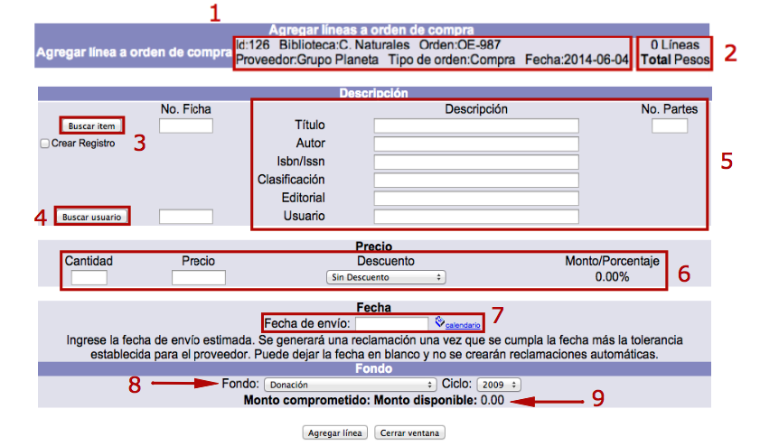

### Enlazar usuario a línea

Como ya se ha explicado, independientemente de que se cree un nuevo registro bibliográfico o se utilicen datos de uno ya existente, si un usuario ha solicitado la compra de un material, se puede **buscar** y **seleccionar** dicho usuario en la base de datos para enlazarlo con la orden de compra y notificarle cuando se reciba el pedido.

El procedimiento a seguir es el siguiente:

-   Estando en la ventana de asignación de líneas a órdenes de compra, hacer clic en el botón **Buscar usuario** de la sección *Descripción*.

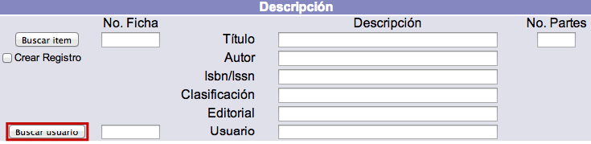

-   En la siguiente ventana emergente que se muestra, introducir el _número de cuenta_ o el _nombre y apellidos_ del usuario en cuestión y hacer clic en el botón **Buscar** que corresponda.

-   Seleccionar el usuario deseado haciendo clic sobre su **ID**.

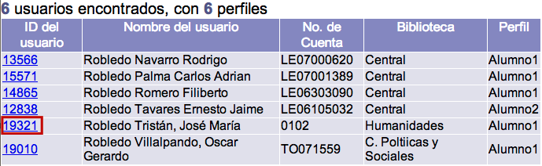

-   Por último, el sistema inserta de forma automática la información en los campos correspondientes.

### Ordenar copias de material que ya existe

El procedimiento a seguir es el siguiente:

-   Estando en la ventana de asignación de líneas a órdenes de compra, hacer clic en el botón **Buscar ítem** de la sección *Descripción*.

-   Se despliega una nueva ventana emergente, en este caso de *Búsqueda avanzada* (igual a las del catálogo al público y el módulo de Control bibliográfico). Introducir los términos de búsqueda deseados y elegir los índices y filtros a aplicar. A continuación, hacer clic en el botón **Buscar**.

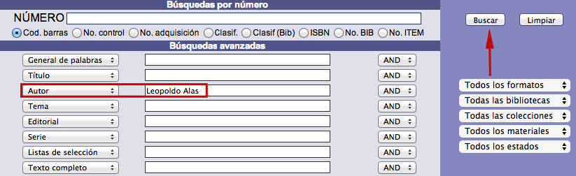

-   El sistema busca el registro y presenta los resultados, bien mediante sumario, si son varios, o mostrando directamente la vista en detalle del registro concreto. Desde esta vista, hacer clic en el botón **Comprar**.

-   Se insertan de forma automática en el formulario los datos del registro seleccionado. Además, en este momento se añaden también nuevos campos correspondientes a la sección *Biblioteca y categorías estadísticas para ítems*.

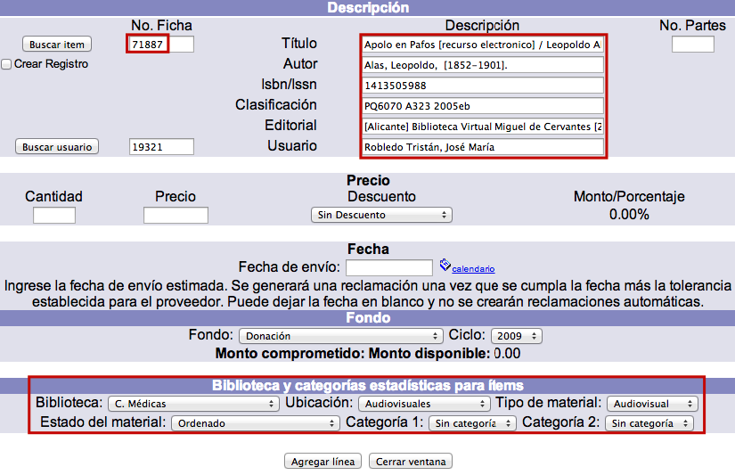

-   Introducir los valores para los campos de la sección *Precio*:

    -   _Cantidad_: número de copias o ejemplares del material que se van a ordenar.
    -   _Precio_: valor económico de cada copia o ejemplar.
    -   _Descuento_: tipo de descuento que aplica el proveedor (este elemento se configura previamente).
    -   _Monto / Porcentaje_: sujeto a la categoría anterior. Si no se va a obtener ningún descuento, no se puede ingresar ninguna cantidad. En cambio, si se elige un tipo de descuento, se determina aquí la cantidad del mismo.

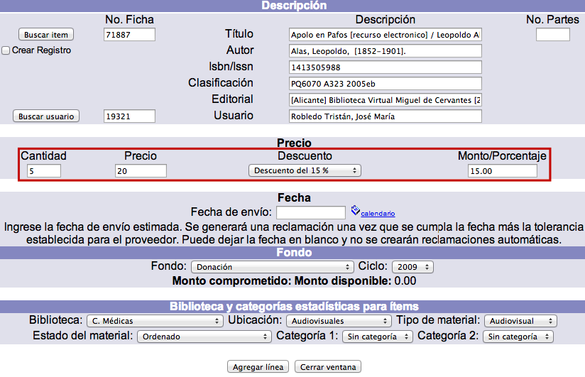

-   Introducir el valor para el campo de la sección *Fecha*:

    -   _Fecha de envío_: fecha probable establecida por la institución para el envío, por parte del proveedor, del material ordenado. Si se decide ingresar un valor en este campo, entonces el material será reclamado **automáticamente** por el sistema en la fecha definida y después de sumar el número de días de margen para reclamaciones que tenga asignado el proveedor en cuestión.El dato de la fecha puede introducirse escribiendo la información directamente en el cuadro de texto (en formato AAAA-MM-DD) o bien, usando la opción de “calendario”.

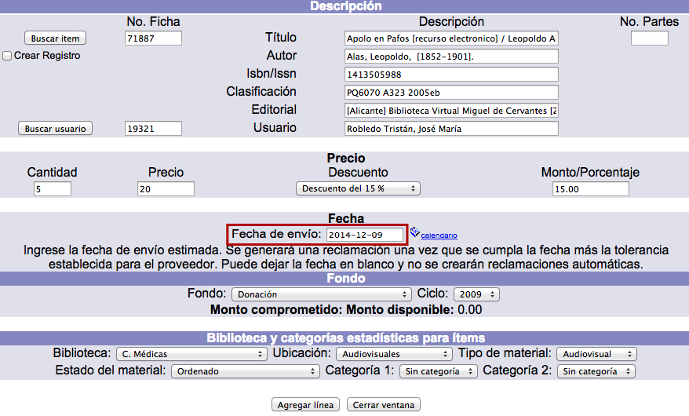

-   Introducir los valores para los campos de la sección *Fondo*:

    -   _Fondo_: opciones creadas durante la configuración previa del módulo, en Administración.
    -   _Ciclo_: relacionado con el fondo, sus opciones también son creadas durante la configuración. Contiene la cantidad del presupuesto asignado.
    -   Los conceptos de _monto comprometido_ y _monto disponible_ se actualizan de forma automática conforme se utiliza la partida para ordenar materiales en esta u otra orden.

-   Introducir o modificar los valores para los campos de la sección *Biblioteca y categorías estadísticas para ítems*:

    -   _Biblioteca_: división institucional a la que pertenecen los materiales ordenados.
    -   _Ubicación_: lugar de destino de las copias que se van a ordenar.
    -   _Tipo de material_: relacionado con el comportamiento del ejemplar en el módulo de Circulación.
    -   _Estado del material_: este parámetro relativo a las copias que se van a ordenar puede ser modificado posteriormente desde el módulo de Control bibliográfico.
    -   _Categoría 1_: categoría estadística 1 para uso interno de la institución.
    -   _Categoría 2_: categoría estadística 2 para uso interno de la institución.

    Finalmente, hacer clic en el botón **Agregar línea** para completar el proceso.

-   El sistema genera la línea y regresa a la pantalla principal mostrando la orden de compra activa con la nueva línea recién creada.

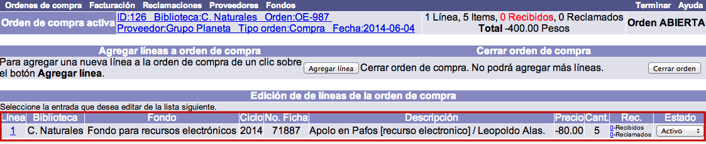

### Ordenar nuevo material

El procedimiento a seguir es el siguiente:

-   Estando en la pantalla de asignación de líneas a órdenes de compra, hacer clic en el botón **Agregar línea**.

-   En la ventana emergente que aparece, dentro de la sección **Descripción**, introducir los datos del nuevo material que se va a ordenar. Cada línea de orden describe un solo material, aunque de él se soliciten una o más copias o ejemplares.

-   Además, si se desea crear un registro bibliográfico en la base de datos con los datos descriptivos registrados, se debe marcar la opción **Crear registro**. Al hacerlo, aparecen tres nuevos campos:

    -   _Formato_: permite elegir el formato del registro bibliográfico que se va a crear.
    -   _Biblioteca_: permite elegir la biblioteca a la que va a pertenecer el registro bibliográfico que se va a crear.
    -   _Nivel de seguridad_: valor numérico jerárquico para determinar la seguridad del registro bibliográfico que se va a crear.

-   Por otra parte, si el registro creado es una suscripción, se debe marcar el campo **Crear suscripción** que, a su vez, despliega el área de *Información para suscripciones*, con los siguientes campos:

    -   _Núm. de suscripción_: número con que se identifica a la suscripción.
    -   _Núm. días suscripción_: cantidad de días en los que la suscripción estará vigente.
    -   _No. copias_: número de copias o ejemplares de cada fascículo recibido por la suscripción.
    -   _No. fascículos_: cantidad de fascículos recibidos durante la suscripción.
    -   _Fecha renovación_: fecha en que debe renovarse la suscripción.

-   El resto del procedimiento de ordenación de nuevo material, así como la forma de configurar las demás secciones (precio, fecha, fondo, biblioteca y categorías estadísticas para ítems) es exactamente igual al detallado en el punto anterior: ***Ordenar copias de material que ya existe***.

## Edición de líneas

Si es necesario, se pueden cambiar algunos de los datos recogidos en las líneas de orden. No obstante, no es posible editar todos los campos, ya que algunos son controlados por el sistema.

_NOTA IMPORTANTE_: las líneas de orden de compra **ya facturadas** no pueden modificarse ni ser borradas. En estos casos, sólo pueden verse sus registros.

El procedimiento a seguir es el siguiente:

-   Identificar la orden de compra correspondiente y seleccionarla, haciendo clic sobre su ID.

-   En la pantalla de gestión de líneas de orden, hacer clic de nuevo en el ID de aquella que se desea editar.

-   Se despliega el registro de la línea. Hacer clic en el botón **Actualizar** para proceder a su edición (o **Cancelar**, si se desea regresar a la pantalla anterior). Si la línea ya fue facturada, no se desplegarán estas dos opciones.Los campos que se presentan en dicho registro son los siguientes:

    -   *No. de orden:* el ID o número interno de la orden de compra, asignado por el sistema, a la que pertenece esta línea de orden.
    -   *No. de línea:* el número de línea, asignado por el sistema, dentro de la orden de compra.
    -   *No. de fondo:* el fondo seleccionado para esta línea.
    -   *Ciclo:* el ciclo de fondo con el que se va a pagar el material de la línea de orden.
    -   *No. biblioteca:* unidad institucional a la que pertenecerán los materiales ordenados.
    -   *No. de solicitud:* el número de la solicitud, si la hay, con la que se pidió que se comprara el material.
    -   *Número de suscripción:* el número de la suscripción relacionada con la línea de orden. La suscripción ya debe estar creada desde el _módulo de Control bibliográfico_, de tal forma que al identificarla en adquisiciones, hace una relación de los datos de la suscripción con la línea de orden.
    -   *No. de días de suscripción:* período que durará la suscripción.
    -   *Fecha renovación suscripción:* fecha en la que debe renovarse la suscripción.
    -   *Número de copias a recibir:* cantidad de copias o ejemplares de cada fascículo recibido por la suscripción.
    -   *Número de fascículos:* cantidad de fascículos o números recibidos durante la suscripción.
    -   *No. de ficha:* si los datos del material se enlazaron a un registro que ya existe en la base de datos, el número del mismo aparece en este campo.
    -   *Descripción 1:* el primer campo de los datos que describen el material que se va a ordenar. Este campo se puede configurar para que describa otro tipo de dato.
    -   *Descripción 2:* el segundo campo de los datos que describen el material que se va a ordenar. Este campo se puede configurar para que describa otro tipo de dato.
    -   *Descripción 3:* el tercer campo de los datos que describen el material que se va a ordenar. Este campo se puede configurar para que describa otro tipo de dato.
    -   *Descripción 4:* el cuarto campo de los datos que describen el material que se va a ordenar. Este campo se puede configurar para que describa otro tipo de dato.
    -   *Descripción 5:* el quinto campo de los datos que describen el material que se va a ordenar. Este campo se puede configurar para que describa otro tipo de dato.
    -   *No. moneda:* la unidad monetaria con la que cobra el proveedor los materiales ordenados.
    -   *Tipo de cambio:* el tipo de cambio de la moneda con la que cobra el proveedor los materiales (la del campo anterior), con relación a la moneda base.
    -   *No. tipo de descuento:* el tipo de descuento que aplicará el proveedor a esta línea de orden.
    -   *Porcentaje de descuento:* el porcentaje, si lo hay, que descontará el proveedor al coste de los materiales ordenados en esta línea.
    -   *Monto de descuento:* cantidad que descontará el proveedor al coste de los materiales ordenados en esta línea.
    -   *Precio:* coste por unidad del material ordenado, en la moneda en la que cobra el proveedor.
    -   *Cantidad:* número de copias o ejemplares del material ordenado en esta línea.
    -   *No. de partes:* cantidad de unidades físicas, cuando hay más de una, que componen cada unidad del material que se va a ordenar. Por ejemplo, si se trata del título de un libro que además está acompañado de un CD, se podría ingresar en este campo el número 2.
    -   *Categoría 1:* la categoría estadística a la que van a pertenecer los materiales que se están ordenando.
    -   *Categoría 2:* otra categoría estadística a la que van a pertenecer los materiales que se están ordenando.
    -   *Id del usuario:* elemento identificador del usuario que está enlazado a esta línea de orden, puede ser el usuario que ha solicitado que se compre el material.
    -   *Nombre:* nombre del usuario que está enlazado a esta línea de orden, puede ser el usuario que ha solicitado que se compre el material.
    -   *Fecha creación:* la fecha en que se creó la línea de orden.
    -   *Fecha de envío:* la fecha en que se envió la orden con esta línea.
    -   *Tipo de cancelación:* el tipo de cancelación que se aplicó a esta línea si es que ha sido cancelada.
    -   *Fecha cancelación:* la fecha en que se canceló la línea de orden.
    -   *Precio\_lista:* campo que puede utilizarse como referencia y en reportes, pero que **no** participa de ningún cálculo en la formación de la orden.

-   Si se ha modificado algún dato, hacer clic de nuevo en el botón **Actualizar** para guardar los cambios. Finalmente, el sistema regresa al sumario de líneas de orden.

## Cancelación de líneas

Para cancelar una línea de orden sólo es necesario cambiar su estado seleccionando el que corresponda **en la lista desplegable de la columna *Estado* del sumario de líneas**. Las razones o motivos de cancelación deben ser configurados previamente por la institución.

Después de cambiar el estado de una línea de orden ya no se podrán recibir materiales de esa línea. Los balances de fondos se ajustarán de acuerdo a las líneas canceladas.

## Recepción de material ordenado

El proceso de recepción de cada material ordenado es un proceso muy simple en el sistema Janium, ya que cada línea de orden creada mantiene una cuenta de la cantidad de unidades pedidas y recibidas.

### Gestión de recepciones

El procedimiento a seguir es el siguiente:

-   Identificar la orden de compra correspondiente y seleccionarla, haciendo clic sobre su ID.

-   En la siguiente pantalla, de entre todos los datos que se despliegan relacionados con las líneas de orden, es necesario fijarse en la columna ***Rec.*** En esta sección, hacer clic sobre el número de dicha columna correspondiente a **Recibidos** de la línea para la que se van a recibir los materiales.

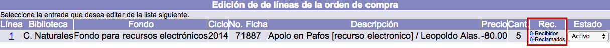

-   Se abre una ventana emergente para continuar con el proceso. En este sentido, el sistema asume que va a recibirse _el mismo número de copias que se ordenaron_; no obstante, esa cifra se puede modificar manualmente en este momento, registrando el dato en el campo ***Cantidad***. Por otra parte, también se puede introducir una fecha de recepción diferente a la utilizada, para lo cual, se debe registrar esa información de forma manual en el campo ***Fecha recepción***, con un formato AAAA-MM-DD. Establecido lo anterior, hacer clic en el botón **Crear**.

-   El sistema cierra la ventana emergente y muestra el sumario de líneas, con el número actualizado de copias recibidas para la línea en cuestión. También se actualiza la cifra total de existencias recibidas para la orden activa.

### Edición de recepciones

Si es necesario, se pueden modificar los registros de recepciones, siempre y cuando el sistema esté configurado para permitir esta acción. Los únicos campos que se pueden editar son los de _fecha de recepción_ y _cantidad_ de copias recibidas.

El procedimiento a seguir es el siguiente:

-   Desde el sumario de líneas de orden, hacer clic sobre el **número de copias recibidas** de la línea cuya recepción se desea editar.

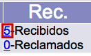

-   En la ventana emergente de recepciones, hacer clic sobre el **ID** de aquella a editar.

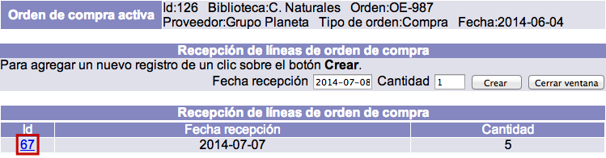

-   Se despliega el registro de la recepción. Hacer clic en el botón **Actualizar** para proceder a su edición (o **Cancelar**, si se desea regresar a la pantalla anterior. O **Borrar**, para eliminar el registro completo). Los campos que se presentan en dicho registro son los siguientes:

    -   *Identificador:* ID o número interno que asigna el sistema automáticamente al registro de la recepción.
    -   *No. de orden:* valor numérico de orden, también otorgado por el sistema, al que pertenece la línea cuya recepción se va a editar.
    -   *No. de línea:* identificador de línea al que pertenece la recepción que se va a editar.
    -   *Fecha recepción:* fecha en que se recibieron la o las copias.
    -   *Cantidad:* cifra de copias recibidas.

-   Si se ha modificado algún dato, hacer clic de nuevo en el botón **Actualizar** para guardar los cambios. Finalmente, el sistema cierra la ventana emergente y regresa al sumario de líneas de orden.