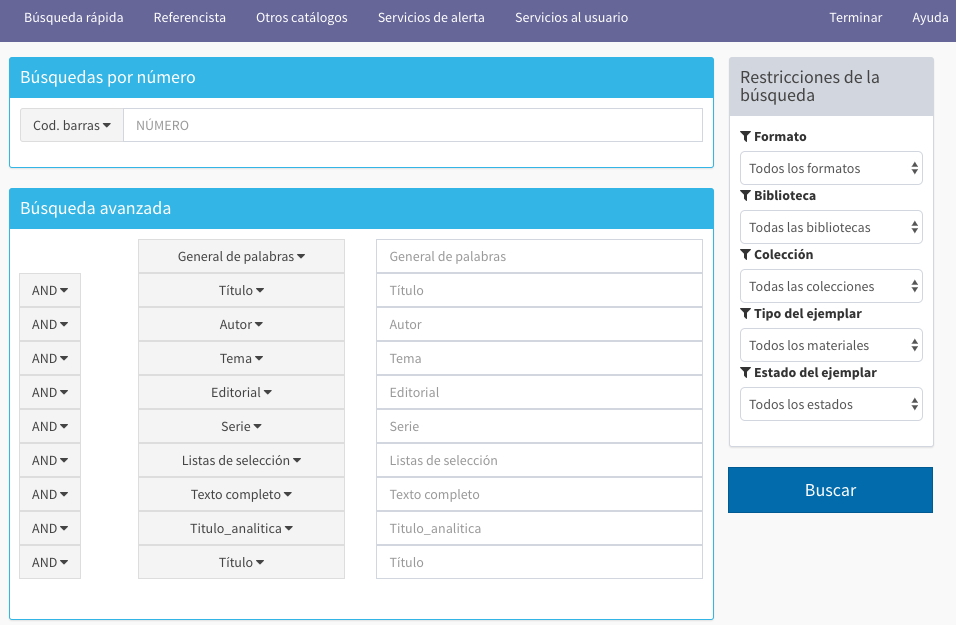
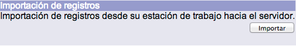
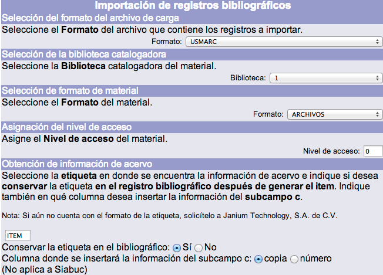
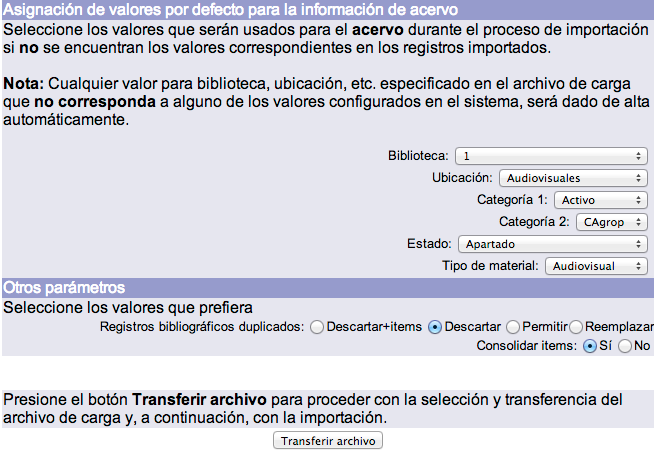
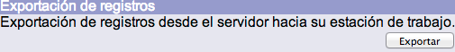
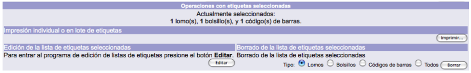

# Menú para registros bibliográficos

La pantalla principal de gestión del módulo de Control bibliográfico presenta el siguiente diseño:

A continuación se describen las funciones principales:

### Barra de herramientas

Este elemento se presenta en primer plano al acceder al módulo. El despliegue de las opciones que lo componen varía dependiendo de cual se esté ejecutando en ese momento.

Las opciones que se presentan son:

- **Menú BIB:** acceso a la pantalla principal del módulo.
- **Información bibliográfica:** acceso a la plantilla del registro activo en la sesión.
- **Existencias MARC:** acceso a la pantalla de creación, edición y borrado de los registros de existencias MARC21 para publicaciones periódicas.
- **Autoridades:** acceso al módulo de Gestión y control de autoridades.
- **Objetos:** acceso a la función de creación, edición y borrado de objetos digitales.
- **Terminar:** función que permite cerrar la sesión activa de trabajo.
- **Mis preferencias:** acceso a la pantalla de definición de las preferencias del operador del módulo.
- **Ayuda:** acceso a la página de ayuda del sistema Janium.

### Búsquedas de registros en el catálogo

Permite realizar búsquedas directamente en el catálogo de la institución sin necesidad de abrir otra sesión en el catálogo al público. También permite buscar y copiar registros bibliográficos desde otros catálogos, a través del protocolo de comunicación Z39.50.

El objetivo principal de ejecutar búsquedas a través del módulo de Control bibliográfico es evitar la existencia de _duplicados_, verificando previamente la presencia o no del material en el catálogo, antes de optar por la creación de un nuevo registro.

Las búsquedas pueden llevarse a cabo de forma **Rápida** o **Avanzada**.

Para cada una de las opciones se desplegará la pantalla correspondiente. Por otro lado, sin importar la elección hecha, la barra de herramientas del módulo de Control bibliográfico se mantiene visible al acceder al catálogo al público.

**NOTA:** antes de crear un registro se debería verificar que el documento no se encuentra ya ingresado en el catálogo. Asimismo, si se localiza un título similar al que se va a ingresar, también sería recomendable que los datos de autor, título y pie de imprenta sean distintos al que se va a crear, para evitar duplicados innecesarios en el sistema.

### Creación de registros bibliográficos

Permite crear registros bibliográficos utilizando diferentes **plantillas** definidas en el sistema.

Para llevar a cabo este procedimiento deben elegirse previamente el _formato_ asociado y la _biblioteca catalogadora_ del material.

La mayoría de los formatos que se despliegan están basados en el estándar MARC21. No obstante, una de las ventajas del sistema Janium en este sentido es que las instituciones pueden definir formatos basados en otras normas, nacionales o internacionales, como pueden ser Dublin Core, ISAD (G), etc.; incluso cabe la posibilidad de determinar el uso de formatos locales.

### Importación de registros

Esta función permite la importación de un archivo con registros en diferentes formatos. Los registros existentes en dicho archivo son importados e indizados en la base de datos después de haber seleccionado los criterios necesarios en la pantalla de gestión.

### Exportación de registros

El sistema exporta a un archivo los registros en formato MARC21 que hayan sido seleccionados. En esta función, es opcional la exportación también de la información de los **ejemplares** vinculados a los registros bibliográficos, que sería colocada en la etiqueta 999 de MARC21.

Para ejecutar este proceso es necesario escribir el _rango de números de ficha_ de los registros que serán exportados en la pantalla de gestión correspondiente.

### Operaciones con etiquetas seleccionadas

Esta función muestra el número de registros seleccionados para su posterior impresión por cada tipo de etiqueta: de **lomo / tejuelos**, de **bolsillo** y de **código de barras**. Además, permite agregar o eliminar de la lista uno o más registros seleccionados, a través de la función de *Edición*.

Las pantallas de información varían dependiendo de si se tienen o no registros seleccionados para su impresión.

