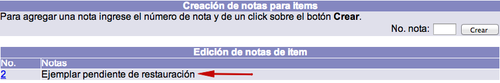

# Notas en registros de ejemplar

Para añadir información relacionada con el ejemplar que no pueda ser registrada en ningún campo del formulario de edición, se pueden utilizar las **notas de ítem**.

En principio, el contenido de estas notas no se despliega en el catálogo al público; la única forma de mostrar esta información es yendo nuevamente a la función *Notas del ítem*.

Para crear una nota de ítem es necesario lo siguiente:

- Tener un registro bibliográfico desplegado con ejemplares asociados.
- Dar clic en el cuadro selector situado junto al número de código de barras.
- En la siguiente pantalla, *Administración de ítems*, y dentro de la sección *Notas del ítem*, dar clic en el botón ***Notas***.

- A continuación, estando en *Creación de notas para ítems*, escribir en el campo de texto ***No. nota*** el número de nota que se desea crear (_este número debe ser entero y no necesariamente debe iniciar con el número 1_) y hacer clic en el botón *Crear*.

- Después, escribir en el campo de texto ***Notas*** la información que desea registrarse para el ejemplar y hacer clic en el botón *Crear*. Además, en este punto, al poner la indicación **(OPAC)** antes del texto de la nota, convierte a esta en una nota que se puede desplegar en el catálogo al público. De esta forma, se obtienen _notas públicas_ (visibles desde el catálogo al público) y _notas privadas_ (sólo para el personal de la biblioteca).

- El sistema regresa a la pantalla de *Creación de notas para ítems*, mostrando en la parte inferior el texto escrito.

### Gestión de material acompañante a ejemplares

El sistema Janium permite gestionar los materiales acompañantes de acuerdo a las necesidades de la institución; para ello es necesario, primeramente, responder si:

1.  ¿Es necesario que el material acompañante tenga su propio **código de barras**?

2.  ¿Es posible que el material acompañante **se preste de forma independiente** al material principal?

3.  ¿El material acompañante se tiene en una **ubicación diferente** al material principal?

4.  ¿Los materiales acompañantes **se inventarian de forma independiente** a los materiales principales?

Si se ha respondido afirmativamente a alguna de las preguntas, entonces es necesario crear como ejemplar el material acompañante, asignándole un código de barras. Esto permitirá gestionarlos de forma independiente (inventario, préstamo, devolución, renovación, etc.).

Pero si a la biblioteca no le interesa gestionar de forma independiente estos materiales, entonces no es necesario crearlos como ejemplares. En este caso, lo que sí se debe hacer es **registrar los datos informativos correspondientes** en el registro del ejemplar y en el registro bibliográfico, de esta forma:

- En el campo *Número de piezas* en el registro del ejemplar es necesario escribir de cuántas partes se compone el ejemplar (por ejemplo, si se trata de un libro con un disco compacto se tendría que escribir el número 2). Esto hará que al registrar la devolución del material el sistema informe al operador que se deben recibir dos piezas.

- Crear una **nota pública** en el registro del ejemplar mencionando las piezas que conforman el mismo. Esto permitirá al usuario saber que el ejemplar de su interés tiene un material complementario.

- Escribir la información del material complementario en el **campo 300**, **subcampo e** del formato MARC21 Bibliográfico.

