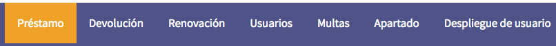
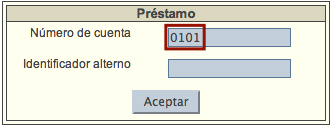
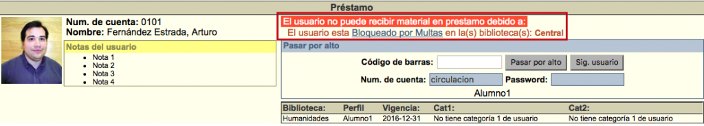
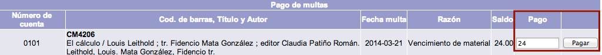
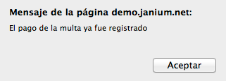

# Pago de multas
## Pago monetario desde Préstamo

El procedimiento a seguir es el siguiente:

-   Hacer clic sobre la opción **Préstamo** de la barra de herramientas del módulo.

-   En el cuadro que aparece, escribir el número de cuenta del usuario en el campo correspondiente y hacer clic en el botón **Aceptar**.

-   Se despliega la ficha de información del usuario, con el mensaje de alerta de multas mencionado anteriormente. Hacer clic sobre el texto del mensaje (***Bloqueado por multas***).

-   El sistema muestra la lista de multas económicas con los datos del usuario y del material vinculados. Escribir la cantidad a pagar en el cuadro de texto del campo **Pago**. A continuación, hacer clic en el botón **Pagar**.

-   Después de la acción anterior, aparece el mensaje informando del pago de la sanción. Hacer clic en el botón **Aceptar**.

-   Para terminar, si la multa fue pagada **en su totalidad** el sistema regresa a la pantalla de préstamo. Si el pago es **parcial**, vuelve a la lista de multas mostrando la cantidad pendiente de abonar.

## Pago monetario desde Multas

El procedimiento a seguir es el siguiente:

-   Hacer clic sobre la opción **Multas** de la barra de herramientas del módulo.

-   Escribir el número de cuenta del usuario en el campo de texto de la sección *Pago de multas*. Hacer clic en el botón **Pagar**.

-   El sistema muestra la lista de multas económicas con los datos del usuario y del material vinculados. Escribir la cantidad a pagar en el cuadro de texto del campo **Pago**. A continuación, hacer clic en el botón **Pagar**.

-   Después de la acción anterior, aparece el mensaje informando del pago de la sanción. Hacer clic en el botón **Aceptar**.

-   Para terminar, si la multa fue pagada **en su totalidad** el sistema regresa a la pantalla de préstamo. Si el pago es **parcial**, vuelve a la lista de multas mostrando la cantidad pendiente de abonar.