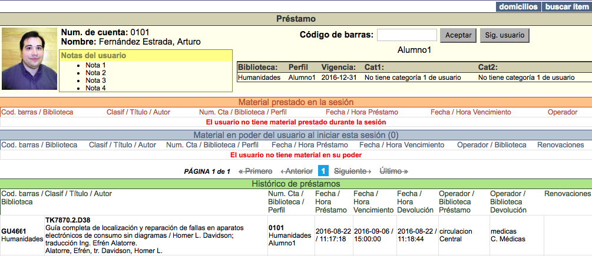
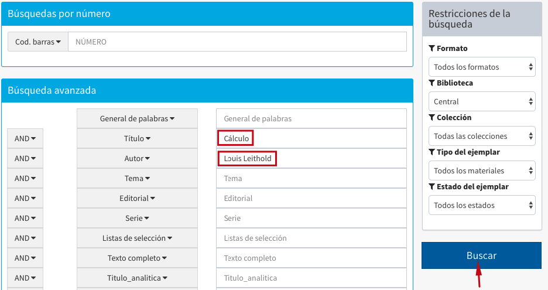
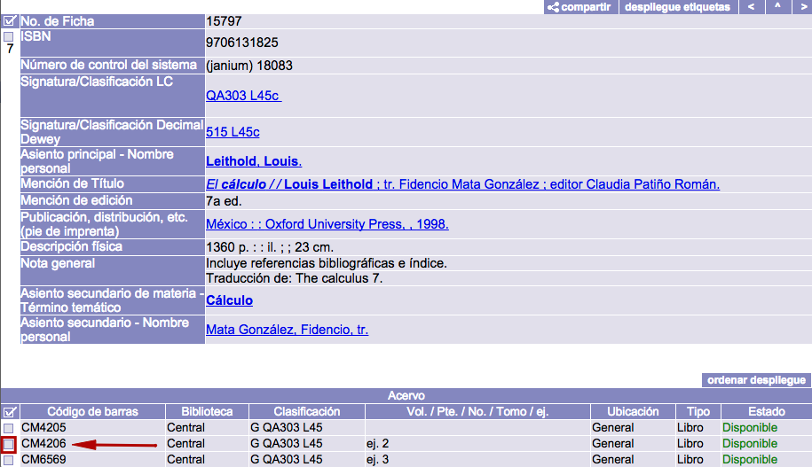

# Préstamos

Estos procesos consisten en inscribir al usuario solicitante, utilizando su **número de cuenta**, y al material solicitado, a través de su **número de código de barras**, en un registro de préstamo. El sistema asigna la fecha y hora de devolución correspondiente considerando el _mapa de circulación_ configurado, que engloba, a su vez, los datos sobre: perfil del usuario, tipo de material, biblioteca prestataria, biblioteca del usuario y regla de circulación (periodo de préstamo + multa asociada).

Los préstamos pueden ser por horas o días, dependiendo de las **políticas definidas por la institución**, y se realizan cuando el usuario tiene un estado *OK* y el material está *Disponible* para ser prestado.

Por lo general, un usuario tiene el estado ***OK*** cuando:

- No tiene multas monetarias pendientes de pago.

- No tiene suspensiones administrativas.

- No tiene préstamos vencidos.

- Puede tener materiales en préstamo (todavía no vencidos).

- Puede tener materiales reservados.

- No han expirado sus privilegios de usuario.

A su vez, también de forma genérica, un material se considera ***Disponible*** cuando:

- La institución ha decidido que circule y sea accesible (ya sea alojado en salas, estanterías o depósitos no abiertos al público).

- No ha sido reservado por algún usuario.

- Tiene un nivel de seguridad asociado menor o igual al nivel del usuario que lo solicita.

### Pantalla

La pantalla de Préstamo se compone de cinco secciones:

- **Información del usuario**, que muestra lo siguiente:

    - Fotografía del usuario.
    - Número de cuenta.
    - Nombre y apellidos del usuario.
    - Biblioteca (s), perfil (es) y vigencia (s) del usuario.

- **Campo de código de barras y notas**, que muestra lo siguiente:

    - Campo de texto para escribir el código de barras del material.
    - Notas informativas vinculadas al usuario.

- **Lista de material prestado en la sesión activa**, que muestra lo
    siguiente:

    - Código de barras y biblioteca del ejemplar.
    - Clasificación, título y autor.
    - Número de cuenta del usuario, biblioteca del usuario y perfil.
    - Fecha y hora de préstamo.
    - Fecha y hora de vencimiento.
    - Número de cuenta del operador de Circulación.

- **Lista de material en poder del usuario al iniciar la sesión
    activa**, que muestra lo siguiente:

    - Código de barras y biblioteca del ejemplar.
    - Clasificación, título y autor.
    - Número de cuenta del usuario, biblioteca del usuario y perfil.
    - Fecha y hora de préstamo.
    - Fecha y hora de vencimiento.
    - Número de cuenta y biblioteca del operador de Circulación.
    - Renovaciones efectuadas.

- **Lista de préstamos acumulados (*histórico de préstamos*)**, que
    muestra lo siguiente:

    - Código de barras y biblioteca del ejemplar.
    - Clasificación, título y autor.
    - Número de cuenta del usuario, biblioteca del usuario y perfil.
    - Fecha y hora de préstamo.
    - Fecha y hora de vencimiento.
    - Fecha y hora de devolución.
    - Número de cuenta y biblioteca del operador de Circulación responsable del préstamo.
    - Número de cuenta y biblioteca del operador de Circulación responsable de la devolución.
    - Renovaciones efectuadas.

### Procedimiento de préstamo

- Hacer clic sobre la opción **Préstamo** de la barra de herramientas del módulo.

- En el cuadro que aparece, escribir el _número de cuenta del usuario_ en el campo correspondiente y hacer clic en el botón **Aceptar**.

- Estando en la pantalla de Préstamo, hacer clic en el botón **buscar ítem**, situado en la parte derecha de la misma, para acceder a la función de _búsqueda avanzada_ del catálogo (en ventana emergente) y así llevar a cabo la búsqueda del ítem que se va a prestar. Esto solo en caso de que el usuario no conozca el código de barras del material que desea en préstamo. En caso contrario, **no es necesario realizar la búsqueda**, basta con teclear el código o escanearlo con un lector óptico.

- Introducir los términos de búsqueda correspondientes, ejecutar la acción y desplegar el registro bibliográfico del material en cuestión para seleccionar uno de sus ítems, _haciendo clic sobre su cuadro selector_.

- El sistema introduce automáticamente el _número de código de barras del ítem a prestar_ que se ha seleccionado en el campo de texto de la sección destinada para ello. Hacer clic en el botón **Aceptar**.

- Al llevar a cabo la acción anterior, los datos del préstamo registrado se despliegan en la lista **Material prestado en la sesión**.

### Préstamos a usuarios con varios perfiles

Un usuario puede tener asignados diferentes perfiles para distintas bibliotecas. Por ejemplo, podría ser **Alumno de posgrado** con un perfil asociado a la biblioteca de la facultad de _Derecho_ y a la vez **Profesor**, con otro perfil relacionado con la biblioteca de la facultad de _Medicina_.

Esta circunstancia implica que el usuario puede obtener préstamos utilizando cualquiera de sus perfiles. En este sentido, el sistema permite seleccionar el perfil al cual serán vinculados los préstamos en el momento de la solicitud del usuario.

El procedimiento a seguir es exactamente igual que el ya explicado, salvo por un paso añadido:

- Justo después de introducir el número de código de barras del material y antes de ejecutar el préstamo mediante el botón *Aceptar*: hacer clic sobre el **perfil que se desea vincular** al material solicitado. Los perfiles se despliegan debajo del campo *Código de barras*.

### Alertas de préstamo
#### Alerta al intentar prestar un material ya prestado

Puede ocurrir que un usuario solicite en préstamo un material que ya esté en posesión de otra persona. Ante esta situación, la medida ideal es que la biblioteca detenga el material para investigar _por qué esta físicamente disponible pero en el sistema está registrado como prestado_.

El posible mensaje de alerta es el siguiente:

> No se pudo realizar el préstamo debido a que el material está prestado al usuario:
> Número de cuenta: 1234 Nombre: Juan Rodríguez Magán

#### Alerta al intentar prestar un material no registrado

Cuando un usuario solicita en préstamo un material cuyo código de barras no está registrado, el sistema presenta la alerta correspondiente. El mismo aviso se presenta cuando el número de código de barras fue escrito **de forma equivocada**.

La medida ideal en este caso es que la biblioteca detenga el material para confirmar _si el número de código de barras ha sido escrito correctamente_ al intentar registrar el préstamo. Si es necesario, tendría que ser remitido al área de Control Bibliográfico para su búsqueda en la base de datos bibliográfica.

El posible mensaje de alerta es el siguiente:

> No se pudo realizar el préstamo debido a que no existe registro alguno que tenga el código de barras ingresado.

#### Alerta por número máximo de préstamos en uno de los perfiles de usuario

Como ya se ha explicado, un usuario puede tener asignados varios perfiles para diferentes bibliotecas, esto implica que puede obtener materiales en préstamo utilizando cualquiera de ellos.

En el momento de la solicitud, el sistema revisa el **número máximo de préstamos que puede obtener el usuario para cada uno de sus perfiles**. Si en alguno ya se ha alcanzado este límite, se alerta al operador de dicha situación. No obstante, el sistema continuará registrando los siguientes préstamos en otro perfil disponible.

El posible mensaje de alerta es el siguiente:

> El usuario: 1234 llegó al límite de sus préstamos con el perfil: Alumno

#### Alerta por privilegios vencidos en uno de los perfiles de usuario

Cabe la posibilidad de que los privilegios o permisos establecidos por la institución para alguno de los perfiles de un usuario pierdan su vigencia por algún motivo. Si se produce esta circunstancia, el sistema muestra el aviso correspondiente y utiliza otro perfil disponible para seguir registrando los préstamos.

El posible mensaje de alerta es el siguiente:

> Han vencido los privilegios del usuario para el perfil: Profesor.

### Opción “pasar por alto”

Al intentar registrar un préstamo de material puede presentarse algún tipo de impedimento que evite seguir adelante con el proceso. Las restricciones principales que pueden producirse son las siguientes:

- Usuario bloqueado por multa.
- Usuario con privilegios vencidos.
- Usuario con máximo de préstamos registrados.
- Usuario con préstamos vencidos.
- Usuario con total de préstamos registrados.
- Material que no circula (no se presta).
- Material con nivel de acceso mayor al autorizado al usuario.
- Material apartado por otro usuario.
- Usuario con máximo de préstamos por tipo de material.

Para todas estas situaciones es posible, si la institución lo autoriza, registrar el préstamo del material en cualquier caso. Para llevar a cabo esto es necesario que haya un **operador del módulo con privilegios de “pasar por alto”**. Estos permisos se configuran al definir los operadores del módulo en la política *Privilegios del staff de circulación* del módulo de Administración.

Sobre el _procedimiento a seguir_: en el momento de identificar al usuario o material en la sección de *Préstamo*, el sistema revisa los estados de ambos para detectar si existe alguna restricción. En caso de haberla, se despliega la alerta correspondiente agregando la opción **Pasar por alto** en la pantalla.

A continuación, el operador con privilegios de “pasar por alto” puede escribir el _código de barras_ del material a prestar, además de su _número de cuenta_ y _contraseña_ para autorizar el registro del préstamo. No obstante, es importante mencionar que el uso de esta opción **no elimina la restricción existente** sobre el usuario o el material, por lo que, al intentar registrar otro movimiento, el sistema avisará nuevamente de ella a través de alertas.