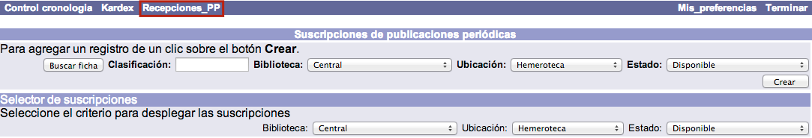
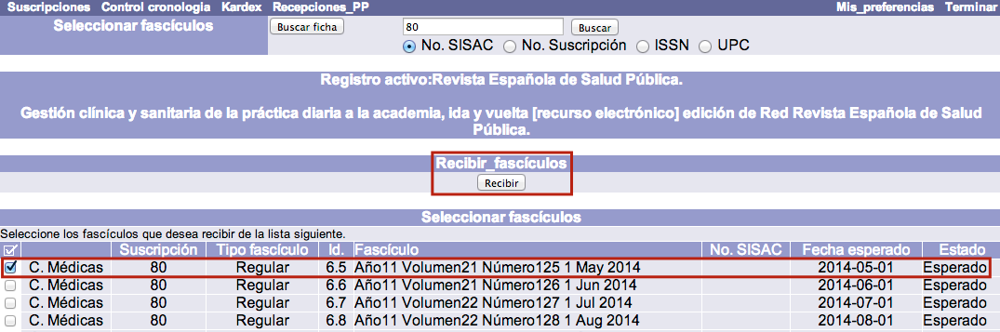
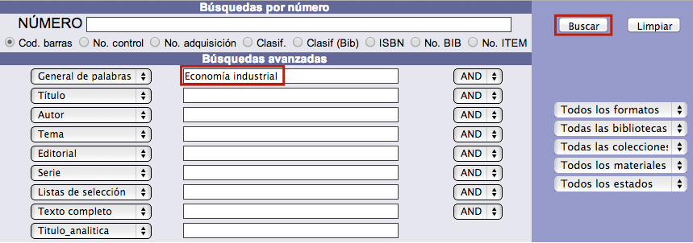
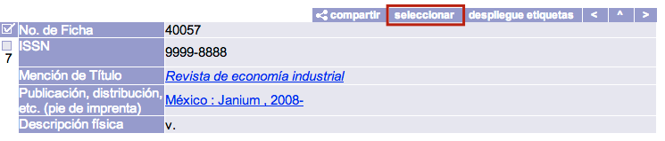

# Recepción rápida de fascículos

El proceso de recepción de fascículos, cuando ya se ha creado la suscripción, el control de cronología y se han predicho los números, es muy simple.

El procedimiento a seguir es el siguiente:

- Hacer clic sobre la opción **Recepciones\_PP** de la barra de herramientas del módulo.

- El sistema presenta la pantalla para localizar de manera directa la suscripción de la que se va a recibir el fascículo. Introducir el valor a buscar, seleccionar el elemento deseado y hacer clic en el botón **Buscar**. En esta pantalla se puede buscar por número de suscripción, número SISAC (*Serials Industry Systems Advisory Committee*), ISSN (*International Standard Serial Number*) o UPC (*Universal Product Code*).También puede hacerse a través de la opción de Búsqueda avanzada del sistema, haciendo clic en el botón **Buscar ficha**.

- Si existe la suscripción buscada, se despliega la lista de fascículos para proceder a su recepción. Marcar aquellos que se quieren incluir y hacer clic en el botón **Recibir**.

Como se ha comentado, una de las opciones de búsqueda de suscripciones es la **Búsqueda avanzada** del sistema. En este caso, se debe proceder de la siguiente forma:

- En la ventana emergente que aparece al pulsar el botón **Buscar ficha**, introducir los elementos de búsqueda necesarios en los campos y hacer clic en el botón **Buscar**.

- Una vez encontrado el registro de la publicación periódica cuyos fascículos se desean recibir, seleccionar el mismo haciendo clic en la opción **Seleccionar** de su despliegue en detalle. Con esta última acción, el sistema detecta que se van a recibir uno o más números para esa suscripción y muestra la lista de fascículos ya explicada.

