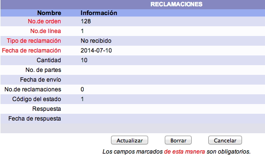

# Reclamación de material

Los materiales ordenados y no recibidos pueden ser reclamados a los proveedores. Cada línea de orden aún no enlazada a una factura contiene una opción para reclamar uno o más ejemplares o copias.

_NOTAS IMPORTANTES_:

1.  Después de facturar, **ya no es posible reclamar un ejemplar**, puesto que se asume que con la introducción de los datos de la factura enviada por el proveedor, se está aceptando el pedido.

2.  Por cada reclamación, se crea un registro de ella en la base de datos, por lo que, si se recibe un material que ha sido reclamado y ésta se anula, **el registro de reclamación correspondiente no se borra**, sino que se despliega un mensaje indicando tal situación.

## Creación de reclamaciones

El procedimiento a seguir es el siguiente:

- Identificar la orden de compra correspondiente y seleccionarla, haciendo clic sobre su ID.

- En la siguiente pantalla, de entre todos los datos que se despliegan relacionados con las líneas de orden, es necesario fijarse en la columna ***Rec.*** En esta sección, hacer clic sobre el número de dicha columna correspondiente a **Reclamados** de la línea para la que se van a reclamar los materiales.

- Se abre una ventana emergente en la que se pueden registrar: cuántos ejemplares se están reclamando, en qué fecha y el motivo o razón de la reclamación. Por omisión, aparece la _fecha actual_ y el _número de ejemplares que se ordenaron_.Una vez establecidos los valores deseados, hacer clic en el botón **Reclamar**.

- El sistema cierra la ventana emergente y muestra el sumario de líneas, con el número actualizado de copias reclamadas para la línea en cuestión. También se actualiza la cifra total de existencias reclamadas para la orden activa.

## Edición de reclamaciones

El procedimiento a seguir es el siguiente:

- Estando en cualquier pantalla del módulo, hacer clic en la opción **Reclamaciones** de la barra de herramientas principal.

- En la lista o sumario de reclamaciones al que se accede, identificar aquella que se va a editar y seleccionarla haciendo clic sobre su **ID**.

- Se despliega el registro de la reclamación. Hacer clic en el botón **Actualizar** para proceder a su edición (o **Cancelar**, si se desea regresar a la pantalla anterior. O **Borrar**, para eliminar el registro completo).Los campos que se presentan en dicho registro son los siguientes:
    
    - *No. de orden:* número de la orden a la que pertenecen los materiales reclamados. Es ingresado automáticamente por el sistema.
    - *No. de línea:* número de línea de orden correspondiente a los materiales reclamados. Es ingresado automáticamente por el sistema.
    - *Tipo de reclamación:* este parámetro se crea durante la configuración previa del módulo. La institución puede crear los tipos de reclamación que necesite. Este campo pretende reflejar la razón o motivo de la reclamación.
    - *Fecha de reclamación:* fecha en que se creó la reclamación. Es ingresada automáticamente por el sistema.
    - *Cantidad:* cifra de ejemplares o copias reclamadas.
    - *No. de partes:* número de unidades físicas, cuando hay más de una, que componen cada unidad del material que se está reclamando. Por ejemplo, si se trata del título de un libro que además está acompañado de un CD, se puede registrar en este campo el número **2**.
    - *Fecha de envío:* fecha en que se envió la reclamación al proveedor.
    - *No. de reclamaciones:* cantidad de reclamaciones enviadas al proveedor.
    - *Código del estado:* valor numérico que representa el estado en que se encuentra la reclamación. Si se cambia, la reclamación ya no se desplegará en la lista o sumario de reclamaciones.
    - *Respuesta:* respuesta del proveedor a la reclamación.
    - *Fecha de respuesta:* fecha en que se recibió la respuesta del proveedor.

