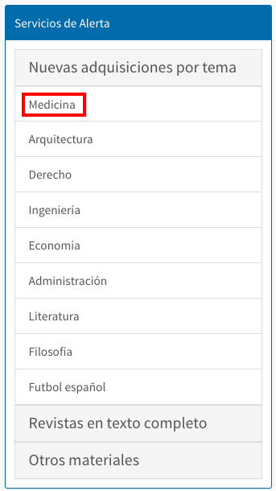

# Servicios de alerta

El sistema Janium permite configurar un apartado en el catálogo al público donde los usuarios puedan encontrar información organizada en diferentes **categorías**.

Estas categorías responden a criterios determinados por la institución, en base a sus necesidades. Teniendo esto en cuenta, los servicios de alerta pueden ser gestionados, por ejemplo, como *listas de novedades* o con el objetivo de dar a conocer ciertas _colecciones_ o _materiales_ concretos.

Conforme a esta circunstancia, los registros vinculados a las listas se actualizarán automáticamente, de forma que permanezcan en ellas el tiempo que establezca la institución y sean eliminados al concluir ese período.

