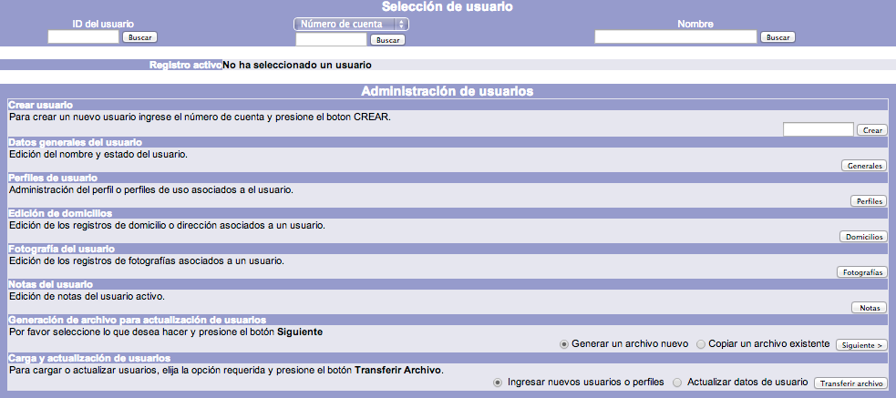
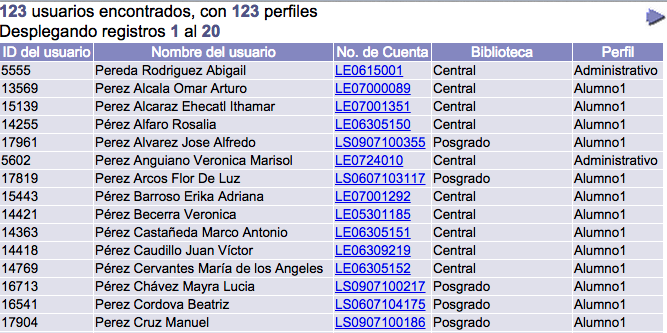
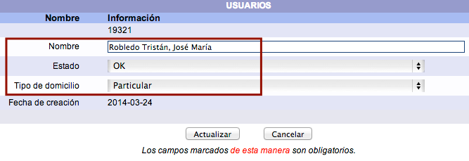

# Usuarios

Esta sección del módulo está relacionada con la **administración de usuarios** y en ella se ejecutan las funciones de búsqueda, creación, modificación y borrado de los mismos.

Además, de forma adicional, también es posible vincular una fotografía al usuario, o crear notas internas informativas para su uso por parte de los operadores del módulo.

Independiente de esta sección es **Despliegue del usuario**, cuyo uso principal es mostrar la _información de circulación global vinculada al usuario seleccionado_.

## Búsqueda de usuarios

Desde la pantalla de **administración de usuarios** es posible buscar registros de usuarios por: ID del usuario, número de cuenta, identificador alterno y nombre. Estas búsquedas tienen como objetivo tener como **registro activo** al usuario requerido, para después poder _desplegar_, _modificar_ o _borrar_ su información.

### Búsqueda por ID del usuario

El ID del usuario es el número asignado de forma automática **por el sistema** a cada usuario. Este número es único e irrepetible, por lo que no puede ser utilizado para otro usuario y no puede ser modificado por los operadores del módulo.

El ID del usuario no aparece en la ficha de introducción de datos. Para verlo, es necesario acceder a la sección *Datos generales del usuario*, mediante el botón **Generales**.

El procedimiento a seguir es el siguiente:

- Hacer clic sobre la opción **Usuarios** de la barra de herramientas del módulo.

- Escribir el _ID del usuario_ en el campo de texto correspondiente de la sección *Selección de usuario*. Hacer clic en el botón **Buscar**.

- El sistema muestra el nombre del usuario como **registro activo**.

### Búsqueda por número de cuenta e identificador alterno

El **número de cuenta** es el dato principal por el cual es identificado el usuario para poder registrarle operaciones en el módulo de Circulación (préstamos, devoluciones, etc.). Además, es el que usa el propio usuario para ingresar a *Servicios al usuario*. Puede ser alfanumérico y tener una longitud de hasta 320 caracteres. Por otro lado, debe ser **único**; es decir, dos personas diferentes no pueden tener el mismo número de cuenta. Cabe mencionar que es sensible a mayúsculas y minúsculas (el número de cuenta _PRUEBA_ es diferente al número de cuenta _prueba_).

En cuanto al **identificador alterno**, como su nombre indica, es otro elemento complementario que puede ser usado para identificar a un usuario. También puede ser alfanumérico, tener una longitud de 320 caracteres y deber ser **único**. Su uso es _opcional_, por lo que es responsabilidad de la institución decidir si su introducción es obligatoria o no.

El procedimiento a seguir es el siguiente: (Tomamos como ejemplo una búsqueda _por número de cuenta_)

- Hacer clic sobre la opción **Usuarios** de la barra de herramientas del módulo.

- Seleccionar la opción de búsqueda deseada y escribir el dato en el campo de texto correspondiente de la sección *Selección de usuario*. Hacer clic en el botón **Buscar**.

- El sistema muestra el nombre del usuario como **registro activo**.

### Búsqueda por nombre

En este sentido, en primer lugar, la institución debe elegir la **forma de escritura** que va a ser utilizada para registrar los nombres de sus usuarios, ya que el método de búsqueda que lleva a cabo el sistema es _alfabético_.

Por ejemplo, si se decide registrar los nombres con el orden **Apellido(s), Nombre(s)** no será posible hacer búsquedas _comenzando_ con el nombre del usuario (como María, Juan, José) al no ser éste el primer dato del campo. Ahora bien, no es necesario introducir el nombre completo del usuario para ejecutar la búsqueda, bastando con una parte del término.

El procedimiento a seguir es el siguiente:

- Hacer clic sobre la opción **Usuarios** de la barra de herramientas del módulo.

- Escribir el _nombre del usuario_ en el campo de texto correspondiente de la sección *Selección de usuario*. Hacer clic en el botón **Buscar**.

- Se despliega una ventana emergente con la lista de usuarios coincidentes con los términos introducidos. Hacer clic sobre el **número de cuenta** deseado.

- El sistema transfiere la información a la pantalla anterior y muestra el nombre del usuario como **registro activo**.

#### Uso de *comodines* en búsqueda por nombre

En esta opción de búsqueda de usuarios, es posible usar el símbolo de truncamiento * (asterisco) como *comodín* cuando se tengan dudas sobre el término que se desea encontrar, o bien cuando se quiera llevar a cabo una búsqueda amplia de usuarios.

Los comodines pueden utilizarse de dos formas:

- Colocados al **comienzo** de la raíz del término.

- Colocados **al final** de la raíz del término.

## Consulta y edición de datos generales del usuario

Es posible realizar consultas y cambios en algunas de las informaciones ya recogidas en el registro del usuario.

El procedimiento a seguir es el siguiente:

- Hacer clic sobre la opción **Usuarios** de la barra de herramientas del módulo.

- Buscar al usuario en cuestión por ID del usuario, número de cuenta / identificador alterno o nombre.

- Teniendo al usuario como **registro activo**, hacer clic en el botón **Generales** de la sección *Datos generales del usuario*.

- El sistema muestra la pantalla de *USUARIOS*. Hacer clic sobre el botón **Actualizar**, en caso de que se necesiten modificar los datos de alguno de los campos permitidos (nombre, estado y tipo de domicilio). Para guardar los cambios, dar clic de nuevo en el botón **Actualizar**.

