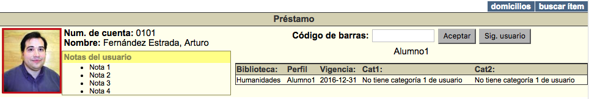
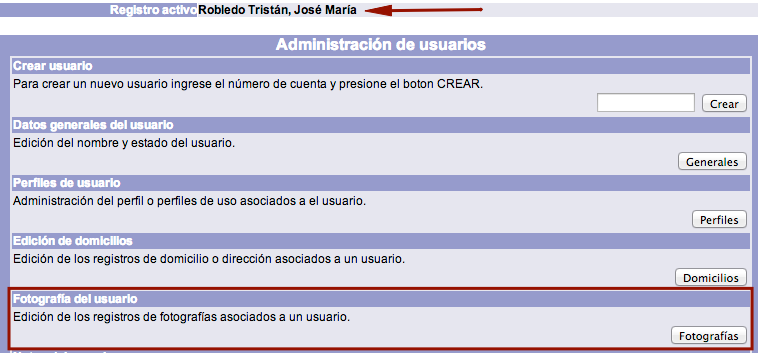
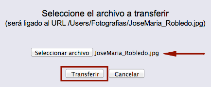

# Vinculación de fotografía al usuario

La fotografía que es asociada al registro de un usuario se ve en las funciones de **préstamo**, **devolución** y **despliegue del usuario**, para permitir una identificación adecuada del mismo.

El procedimiento a seguir es el siguiente:

- Hacer clic sobre la opción **Usuarios** de la barra de herramientas del módulo.

- Buscar al usuario en cuestión por _ID del usuario_, _número de cuenta / identificador alterno_ o _nombre_.

- Teniendo al usuario como **registro activo**, hacer clic en el botón **Fotografías** de la sección *Fotografía del usuario*.

- Se despliega la pantalla de asignación de objetos digitales para el usuario activo. Hacer clic sobre el botón **Crear**.

- En el formulario que aparece, presionar el botón **Actualizar** para poder editar la información del mismo. Dentro del campo *URL imagen*, escribir la ruta y el nombre del archivo de fotografía. Hacer clic de nuevo en el botón **Actualizar** para guardar los cambios.

- El sistema muestra la pantalla de edición de registros de objetos digitales. Dar clic en el icono **Subir objetos** ubicado a la izquierda del campo *URL imagen*.

- En la ventana emergente que aparece, hacer clic en el botón **Examinar** (o **Seleccionar archivo**, dependiendo del explorador del usuario) para proceder a seleccionar el archivo a transferir en el equipo local.

- Una vez hecho lo anterior, la ruta y el nombre del archivo se muestran en el campo de texto de la ventana emergente ya mencionada. Hacer clic en el botón **Transferir**.

- Finalmente, el sistema despliega el mensaje de transferencia exitosa. Hacer clic sobre el botón **Continuar** para concluir el proceso.

